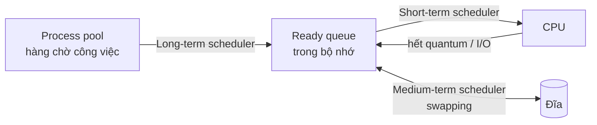
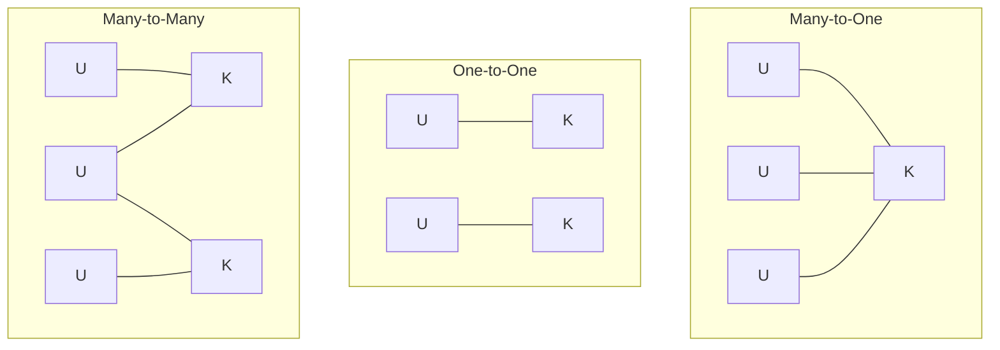
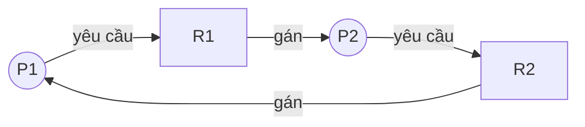

# Hệ điều hành từ đầu: từ system call đến deadlock, bộ nhớ và I/O

> **Cách đọc thuật ngữ trong bài:** tên đầy đủ → viết tắt → ý nghĩa. Ví dụ: Symmetric Multiprocessing (SMP): đa xử lý đối xứng.
> **Nhãn ✦** là nội dung diễn giải hoặc ví dụ do AI tạo, không phải trích nguyên văn từ nguồn.

---

## 1. Hệ điều hành đứng ở đâu giữa chương trình và phần cứng

Khi chúng ta mở một ứng dụng, ứng dụng đó không tự điều khiển CPU, RAM hay ổ đĩa. Nếu mọi chương trình đều làm vậy, chỉ cần một chương trình lỗi là cả máy sập.

Hệ điều hành (Operating System, OS) là lớp phần mềm đứng giữa để **phân chia và bảo vệ** phần cứng cho các chương trình.

### Hai chế độ chạy: user mode và kernel mode

- **Kernel** (nhân): phần lõi của OS, có quyền cao nhất với phần cứng.
- **Kernel mode** (chế độ nhân): CPU cho phép chạy mọi lệnh, kể cả lệnh nguy hiểm.
- **User mode** (chế độ người dùng): CPU chỉ cho phép lệnh an toàn; chương trình thông thường chạy ở đây.

### System call: cửa duy nhất để xin dịch vụ

System call (lời gọi hệ thống) là cách chương trình ở user mode **yêu cầu OS làm việc hộ**, ví dụ mở file hoặc tạo process.

- Khi gọi system call, CPU chuyển sang kernel mode, OS xử lý, rồi trả về user mode.
- ✦ Diễn giải: việc chuyển mode chỉ là hệ quả. Mục đích của system call là cho chương trình xin dịch vụ của OS.

### Nhiều CPU thì chia việc thế nào

| Kiểu | Đặc điểm |
| --- | --- |
| Symmetric Multiprocessing (SMP): đa xử lý đối xứng | Mọi processor ngang hàng, cùng chạy OS |
| Asymmetric Multiprocessing: đa xử lý bất đối xứng | Một master processor điều khiển, phân việc cho các processor còn lại |

### Ba mảng việc chính của OS

- **Quản lý tiến trình (process management):** tạo, xóa tiến trình, **đồng bộ** tiến trình và **xử lý deadlock**.
- **Quản lý bộ nhớ (memory management):** theo dõi vùng nhớ nào đang dùng, **cấp phát và thu hồi** bộ nhớ, quyết định process nào vào hay ra khỏi bộ nhớ.
- **Quản lý tập tin (file system management):** tạo/xóa file và thư mục, cung cấp thao tác cơ bản trên chúng, ánh xạ file lên bộ nhớ phụ, sao lưu lên thiết bị lưu trữ ổn định.

Để quản lý được, trước hết OS cần một đơn vị công việc có thể đếm và điều khiển. Đơn vị đó là tiến trình, và chúng ta chuyển sang nó.

---

## 2. Tiến trình: sinh ra, được chọn chạy và kết thúc

Tiến trình (process) là **một chương trình đang chạy**, kèm theo bộ nhớ và tài nguyên mà nó đang giữ.

### Cha sinh con

Một process có thể tạo process khác: process tạo ra gọi là **parent process** (process cha), process được tạo gọi là **child process** (process con).

Về tài nguyên, có ba khả năng:

- Cha và con **chia sẻ tất cả** tài nguyên.
- Con chỉ dùng **một phần** tài nguyên của cha.
- Cha và con **không chia sẻ** gì.

Về không gian địa chỉ (vùng nhớ của process), có hai khả năng:

- Con là **bản sao** của cha (kiểu `fork()` trên Unix).
- Con có **chương trình mới** được nạp vào (kiểu `exec()` sau `fork()`).

### Khi nào cha được kết thúc con

- Con dùng **vượt quá mức tài nguyên** cho phép.
- Nhiệm vụ giao cho con **không còn cần**.
- Cha kết thúc và OS **không cho con chạy tiếp**. Đây gọi là kết thúc dây chuyền (cascading termination).

### Ba bộ định thời, ba tầm nhìn khác nhau

Bộ định thời (scheduler) là thành phần của OS **chọn process nào được làm gì tiếp theo**. Có ba loại, khác nhau ở tầm xa của quyết định:



| Loại | Việc làm | Tần suất |
| --- | --- | --- |
| Long-term scheduler (dài hạn) | Chọn process từ pool đưa vào bộ nhớ | Hiếm |
| Short-term scheduler (ngắn hạn) | Chọn process trong ready queue để cấp CPU | Rất thường xuyên |
| Medium-term scheduler (trung gian) | Swapping: đưa process ra đĩa rồi nạp lại để giảm mức độ đa chương | Khi cần |

- Swapping là hoán đổi process giữa bộ nhớ và đĩa.
- Trên phần lớn Windows và Unix **không có** long-term scheduler; process được đưa thẳng vào bộ nhớ.

Một process còn có thể tự chia nhỏ thành nhiều luồng chạy song song. Đó là thread.

---

## 3. Thread: chia nhỏ một tiến trình

Thread (luồng) là **một luồng thực thi bên trong process**. Các thread của cùng một process dùng chung bộ nhớ nhưng chạy độc lập với nhau.

### Hai tầng thread

- **User thread:** do **thư viện ở user mode** quản lý, kernel không biết đến [2].
- **Kernel thread:** do **kernel** hỗ trợ và quản lý trực tiếp [2].

Vì CPU chỉ chạy thứ kernel biết, mọi user thread cuối cùng phải **gắn với một kernel thread**. Cách gắn gọi là mô hình đa luồng:



| Mô hình | Cách ánh xạ |
| --- | --- |
| Many-to-One | Nhiều user thread vào **một** kernel thread [2] |
| One-to-One | Mỗi user thread vào **một** kernel thread riêng [2] |
| Many-to-Many | Nhiều user thread ghép vào **một số** kernel thread [2] |

- Linux dùng **One-to-One** [2].

### Thư viện thread: ai quản lý ở mức nào

| Thư viện | Mức |
| --- | --- |
| Win32 thread | Mức **kernel** trên Windows [2] |
| Portable Operating System Interface Threads (Pthreads) | Có thể là mức **user hoặc kernel**, tùy cách cài đặt [2] |

- Pthreads chỉ là đặc tả API của chuẩn POSIX, nên mức cài đặt không bị ràng buộc.

### Tạo thread trong Java

Java có hai kỹ thuật:

1. Kế thừa lớp `Thread` rồi ghi đè phương thức `run()`.
2. Cài đặt interface `Runnable` rồi truyền đối tượng vào `new Thread(...)`.

✦ Ví dụ minh họa:

```java
class Task implements Runnable {
    public void run() { System.out.println("Chạy trong thread"); }
}
new Thread(new Task()).start();
```

Có nhiều tiến trình và nhiều thread cùng chờ CPU thì phải có luật chọn ai chạy trước. Đó là định thời CPU.

---

## 4. Định thời CPU: ai chạy trước

Định thời CPU (CPU scheduling) là việc short-term scheduler **chọn process trong ready queue để cấp CPU**. Cùng một tập process, mỗi giải thuật cho một thời gian chờ khác nhau.

### Ba đại lượng cần phân biệt

| Đại lượng | Ý nghĩa |
| --- | --- |
| Waiting time (thời gian chờ) | Tổng thời gian process **nằm chờ** trong ready queue |
| Turnaround time (thời gian hoàn thành) | Từ lúc process **vào hệ thống đến lúc xong** |
| Response time (thời gian đáp ứng) | Từ lúc yêu cầu đến lúc có **đáp ứng đầu tiên** |

**Công thức dùng cho mọi bài:** `waiting time = thời điểm xong − thời điểm đến − burst time`. Burst time là thời gian process cần CPU.

### Bốn giải thuật chúng ta cần biết

- **First-Come, First-Served (FCFS):** đến trước chạy trước, chạy một mạch đến xong.
- **Shortest-Job-First (SJF):** chọn process có burst time **ngắn nhất**.
  - **Nonpreemptive:** đã chạy thì chạy hết, không bị chen.
  - **Preemptive** (còn gọi Shortest Remaining Time First, SRTF): process mới đến mà **ngắn hơn phần còn lại** của process đang chạy thì chen vào.
- **Round-Robin (RR):** mỗi process được chạy tối đa một **quantum** (lát thời gian), hết lát thì xếp lại cuối hàng.

### Ví dụ chạy từng bước: FCFS, SJF nonpreemptive, SRTF

✦ Ví dụ minh họa với P1 (đến 0, burst 12), P2 (5, 8), P3 (10, 6), P4 (15, 4):

**FCFS:**

| Process | Chạy | Waiting |
| --- | --- | --- |
| P1 | 0–12 | 0 |
| P2 | 12–20 | 12 − 5 = 7 |
| P3 | 20–26 | 20 − 10 = 10 |
| P4 | 26–30 | 26 − 15 = 11 |

Trung bình = (0 + 7 + 10 + 11) / 4 = **7.0 ms**.

**SRTF (preemptive SJF):**

- Lúc t = 5, P1 còn 7 và P2 mới đến cần 8, nên **P1 chạy tiếp**.
- Lúc t = 10 và 15 cũng vậy: phần còn lại của process đang chạy luôn nhỏ hơn.
- Thứ tự thực tế: P1 (0–12), P3 (12–18), P4 (18–22), P2 (22–30).
- Waiting: 0, 17, 2, 3. Trung bình = 22 / 4 = **5.5 ms**.

**Điểm cần nhớ:** SJF/SRTF cho thời gian chờ trung bình thấp hơn FCFS vì process ngắn không phải xếp sau process dài.

### Ví dụ chạy từng bước: Round-Robin

✦ Ví dụ minh họa với tất cả đến lúc 0: P1 = 12, P2 = 8, P3 = 16, P4 = 4; quantum = 6.

```
P1 | P2 | P3 | P4 | P1 | P2 | P3 | P3
0   6   12   18   22   28   30   36   40
```

| Process | Xong lúc | Waiting = xong − burst |
| --- | --- | --- |
| P1 | 28 | 16 |
| P2 | 30 | 22 |
| P3 | 40 | 24 |
| P4 | 22 | 18 |

Trung bình = 80 / 4 = **20.0 ms**.

### Khi nào chọn giải thuật nào

- **FCFS:** đơn giản, nhưng process ngắn có thể phải chờ sau process dài.
- **SJF/SRTF:** thời gian chờ trung bình thấp, nhưng cần biết trước burst time.
- **RR:** công bằng cho hệ chia sẻ thời gian; quantum quá nhỏ thì tốn công chuyển ngữ cảnh.

Khi nhiều process cùng chạy và cùng đụng vào dữ liệu chung, thứ tự chạy không còn là vấn đề duy nhất. Chúng ta cần đồng bộ.

---

## 5. Đồng bộ: khi các tiến trình dùng chung dữ liệu

Giả sử hai process cùng cộng 1 vào một biến chung. Nếu cả hai đọc giá trị cũ rồi cùng ghi lại, một lần cộng bị mất.

### Các khái niệm tiền đề

- **Race condition** (tình trạng đua): kết quả phụ thuộc vào thứ tự xen kẽ của các process.
- **Critical section** (đoạn găng): đoạn mã truy cập dữ liệu chung, chỉ một process được vào tại một thời điểm.

### Hai cách OS xử lý critical section trong kernel

| Phương pháp | Cách hoạt động |
| --- | --- |
| Nonpreemptive kernel | Process ở kernel mode **chạy đến khi tự nhả CPU**; không bị chen giữa chừng, nên không có race condition trong dữ liệu kernel |
| Preemptive kernel | Cho phép process đang ở kernel mode **bị dừng** để CPU phục vụ process khác |

### Semaphore dùng để ép thứ tự

Semaphore là biến đặc biệt với hai thao tác: `wait` (chờ, nếu chưa có tín hiệu thì bị chặn) và `signal` (báo tín hiệu).

✦ Ví dụ minh họa: ép S1 phải chạy **sau** S2, với `synch` khởi tạo bằng 0.

```
P2:  S2;  signal(synch);
P1:  wait(synch);  S1;
```

- P1 bị chặn ở `wait` cho đến khi P2 làm xong S2 và gọi `signal`.
- Kết quả: **S1 chỉ chạy sau khi S2 hoàn thành.**

Đồng bộ sai hoặc dùng tài nguyên không cẩn thận có thể khiến các process chờ nhau mãi mãi. Đó là deadlock.

---

## 6. Deadlock: các tiến trình chờ nhau mãi mãi

Deadlock (bế tắc) là tình huống một nhóm process **mỗi process giữ một tài nguyên và chờ tài nguyên của process khác**, không ai tiến lên được.

### Bốn điều kiện cùng lúc

Deadlock chỉ xảy ra khi **cả bốn điều kiện cùng đúng** [3]:

1. **Mutual exclusion** (loại trừ tương hỗ): tài nguyên không chia sẻ được.
2. **Hold and wait** (giữ và chờ): giữ tài nguyên này, chờ tài nguyên khác.
3. **No preemption** (không bị lấy lại): tài nguyên không bị cưỡng đoạt.
4. **Circular wait** (chờ vòng tròn): có vòng các process chờ nhau.

### Phòng ngừa: phá một điều kiện

Muốn đảm bảo không bao giờ deadlock, chỉ cần **phá ít nhất một** trong bốn điều kiện [3].

- Cho tài nguyên **chia sẻ** thì phá mutual exclusion.
- Chỉ cho process xin tài nguyên **khi nó chưa giữ gì** thì phá hold and wait.

### Đồ thị cấp phát tài nguyên

Resource-allocation graph là đồ thị biểu diễn ai giữ, ai chờ cái gì:

- **Đỉnh:** process (P) và loại tài nguyên (R); mỗi chấm trong R là một instance (thể hiện).
- **Cạnh gán** R → P: một instance của R **đã cấp** cho P.
- **Cạnh yêu cầu** P → R: P **đang chờ** R.



Cách đọc đồ thị:

- **Không có vòng:** chắc chắn **không** deadlock [3].
- **Có vòng, mỗi loại tài nguyên một instance:** deadlock.
- **Có vòng, có loại tài nguyên nhiều instance:** **chưa chắc** deadlock; vòng chỉ là điều kiện cần [3].

### Tránh deadlock bằng safe state và Banker's Algorithm

**Safe state** (trạng thái an toàn): tồn tại một thứ tự cho **tất cả** process chạy xong lần lượt mà không ai bị kẹt.

- Trạng thái an toàn thì không có deadlock; trạng thái không an toàn **có thể** dẫn đến deadlock.
- Muốn tránh deadlock, OS chỉ cấp tài nguyên khi kết quả vẫn an toàn.

**Banker's Algorithm** (thuật toán nhà băng) kiểm tra điều đó với nhiều instance. Các bước:

1. `Need = Max − Allocation`.
2. `Available = Tổng − Σ Allocation`; đặt `Work = Available`.
3. Tìm process chưa xong có `Need ≤ Work`.
4. Cho nó chạy xong: `Work = Work + Allocation` của nó, ghi vào chuỗi an toàn.
5. Lặp lại. Hết process: **an toàn**. Kẹt: **không an toàn**.

### Ví dụ có chuỗi an toàn

✦ Ví dụ minh họa: 5 process, tài nguyên A(12), B(9), C(7).

| | Allocation | Max | Need |
| --- | --- | --- | --- |
| P0 | 2 3 0 | 5 4 2 | 3 1 2 |
| P1 | 3 2 0 | 5 3 4 | 2 1 4 |
| P2 | 4 0 0 | 5 3 5 | 1 3 5 |
| P3 | 1 2 3 | 4 7 4 | 3 5 1 |
| P4 | 0 1 2 | 2 2 2 | 2 1 0 |

`Available = (12−10, 9−8, 7−5) = (2, 1, 2)`.

| Bước | Chọn | Work sau |
| --- | --- | --- |
| 1 | P4 (Need 2,1,0 ≤ 2,1,2) | (2,2,4) |
| 2 | P1 (Need 2,1,4 ≤ 2,2,4) | (5,4,4) |
| 3 | P0 | (7,7,4) |
| 4 | P3 | (8,9,7) |
| 5 | P2 | (12,9,7) |

Hệ thống **an toàn**, chuỗi là **<P4, P1, P0, P3, P2>**.

### Ví dụ không an toàn

✦ Ví dụ minh họa: 4 process, tài nguyên A(9), B(7), C(6); `Available = (2, 1, 1)`.

- Need: P0 (1,3,3), P1 (1,0,1), P2 (4,4,2), P3 (2,1,3).
- Chỉ P1 chạy được, `Work = (5,3,2)`.
- Sau đó P0 cần C = 3 > 2, P2 cần B = 4 > 3, P3 cần C = 3 > 2: **cả ba kẹt**.

Hệ thống **không an toàn**, không có chuỗi cấp phát.

Từ đầu đến đây, chúng ta xem OS chia CPU và tài nguyên cho process. Còn một tài nguyên đắt giá nữa là bộ nhớ.

---

## 7. Cấp phát bộ nhớ liên tục và hiện tượng phân mảnh

Cấp phát liên tục là cấp cho mỗi process **một khối bộ nhớ liền nhau**. Khối bộ nhớ còn trống gọi là **hole** (lỗ trống).

### Hai cách chia

| Cách | Mô tả |
| --- | --- |
| Phân vùng cố định | Chia bộ nhớ thành các phần kích thước cố định từ trước ✦ |
| Multiprogramming with a Variable number of Tasks (MVT) | Hole được cấp **vừa đủ** cho process; phần còn lại thành một hole mới |

### Hai kiểu phân mảnh, dễ nhầm với nhau

| Kiểu | Bản chất |
| --- | --- |
| External fragmentation (phân mảnh ngoài) | Tổng bộ nhớ trống **đủ** cho yêu cầu nhưng nằm **rời rạc**, không cấp được |
| Internal fragmentation (phân mảnh trong) | Cấp **dư** so với nhu cầu; phần dư nằm **bên trong** vùng đã cấp và không dùng được |

- MVT chủ yếu gặp phân mảnh **ngoài**; phân vùng cố định chủ yếu gặp phân mảnh **trong** ✦.

### Compaction: dồn bộ nhớ

Compaction là **xáo trộn nội dung bộ nhớ để gom các hole thành một khối trống lớn liên tục**.

- **Điều kiện:** địa chỉ phải được gắn **động lúc chạy** (execution-time relocation), vì process bị dời chỗ mà vẫn phải chạy đúng.

Cấp phát liên tục gây phân mảnh. Cách khác để giảm vấn đề là chia bộ nhớ thành các trang cố định.

---

## 8. Paging: chia trang và tính số bit địa chỉ

Paging (phân trang) chia **không gian địa chỉ logic** thành các **page** (trang) và **bộ nhớ vật lý** thành các **frame** (khung trang) có **cùng kích thước**. Một page được đặt vào một frame bất kỳ, không cần liền nhau.

### Công thức

- Địa chỉ logic = **số bit chọn trang** + **số bit offset** (vị trí trong trang).
- Địa chỉ vật lý = **số bit chọn frame** + **số bit offset**.
- Số bit offset = log₂(kích thước trang tính bằng byte).

### Ví dụ có đáp án

✦ Ví dụ minh họa: 32 trang, mỗi trang 1024 byte, bộ nhớ vật lý có 64 frame.

| Thành phần | Tính | Bit |
| --- | --- | --- |
| Chọn trang | log₂ 32 | 5 |
| Offset | log₂ 1024 | 10 |
| **Địa chỉ logic** | 5 + 10 | **15** |
| Chọn frame | log₂ 64 | 6 |
| **Địa chỉ vật lý** | 6 + 10 | **16** |

✦ Ví dụ thứ hai: 16 trang, mỗi trang 2048 byte, 512 frame.

- Logic: log₂ 16 + log₂ 2048 = 4 + 11 = **15 bit**.
- Vật lý: log₂ 512 + log₂ 2048 = 9 + 11 = **20 bit**.

Sai lầm hay gặp: quên cộng offset, hoặc lấy số trang thay vì số frame cho địa chỉ vật lý.

Cuối cùng, OS còn phải nói chuyện với thiết bị bên ngoài và lưu dữ liệu lâu dài.

---

## 9. Ngắt, thiết bị nhập xuất và tập tin

### Ngắt: thiết bị gọi CPU

Interrupt (ngắt) là tín hiệu để thiết bị báo cho CPU có việc cần xử lý.

Khi controller (bộ điều khiển thiết bị) đặt tín hiệu vào **interrupt-request line**, CPU làm ba việc:

1. **Lưu trạng thái hiện tại.**
2. **Nhảy tới interrupt handler** (trình xử lý ngắt) trong bộ nhớ.
3. Xử lý xong thì khôi phục trạng thái và chạy tiếp.

CPU không hủy phép tính đang làm; nó chỉ tạm dừng rồi tiếp tục.

### Vì sao I/O subsystem thiết kế độc lập phần cứng

Input/Output subsystem (hệ thống con nhập xuất) được thiết kế để **không phụ thuộc phần cứng cụ thể**. Lợi ích:

- Người phát triển OS **không phải viết lại** phần I/O cho mỗi thiết bị mới, vì device driver (trình điều khiển thiết bị) che giấu khác biệt giữa các thiết bị.
- Nhà sản xuất phần cứng có thể làm thiết bị **tương thích với giao diện sẵn có** hoặc chỉ cần cung cấp driver, nên thiết bị chạy được trên nhiều OS.

### Hoạt động của quản lý tập tin

Quản lý tập tin gồm **năm việc**:

1. Tạo và xóa file.
2. Tạo và xóa thư mục.
3. Cung cấp thao tác cơ bản (primitive) trên file và thư mục.
4. Ánh xạ file lên bộ nhớ phụ.
5. Sao lưu file lên thiết bị lưu trữ ổn định.

---

## Tóm tắt

- OS bảo vệ và chia sẻ phần cứng; chương trình xin dịch vụ qua **system call**.
- **Process** do cha tạo, kết thúc theo ba lý do; ba scheduler chọn ai vào bộ nhớ, ai chạy CPU, ai bị swap.
- **Thread** gắn user thread vào kernel thread theo Many-to-One, One-to-One hoặc Many-to-Many; Linux dùng One-to-One.
- **Định thời CPU:** nhớ công thức `waiting = xong − đến − burst`; SJF/SRTF cho waiting trung bình thấp nhất.
- **Đồng bộ:** critical section + semaphore (`wait`/`signal`) ép thứ tự thực thi.
- **Deadlock:** cần đủ **bốn điều kiện**; Banker's Algorithm tìm chuỗi an toàn bằng Need, Available, Work.
- **Bộ nhớ:** MVT gây phân mảnh ngoài, compaction cần relocation động; paging tính bit = bit trang/frame + bit offset.
- **I/O và file:** ngắt = lưu trạng thái rồi nhảy tới handler; I/O độc lập phần cứng nhờ driver.

---

## Tài liệu tham khảo

[1] Đề thi "Hệ điều hành", DH21DTB/2023 (tài liệu nguồn chính), Trường Đại học Nông Lâm TP.HCM.

[2] A. Silberschatz, P. B. Galvin và G. Gagne, "Chapter 4: Threads," trong *Operating System Concepts Essentials*, 8th ed. (slide), Wiley, 2011. [Online]. Available: https://www.os-book.com/OS8/os8e/slide-dir/PDF-dir/ch4.pdf. Truy cập: 06/10/2026.

[3] S. Weiss, "Chapter 8: Deadlocks" (slide, dựa trên Silberschatz et al.), CSCI 340, Hunter College, CUNY. [Online]. Available: https://www.cs.hunter.cuny.edu/~sweiss/course_materials/csci340/slides/chapter08.pdf. Truy cập: 06/10/2026.

> ✦ Ghi chú nguồn: phần định thời CPU, đồng bộ, bộ nhớ, paging và I/O được viết từ kiến thức giáo trình chung và tính toán trực tiếp, không trích từ nguồn web; các ví dụ số đã được tính lại bằng tay.

---

## Revision History

| Version | Ngày | Thay đổi |
| --- | --- | --- |
| 1 | 2026-10-06 | Initial draft |
