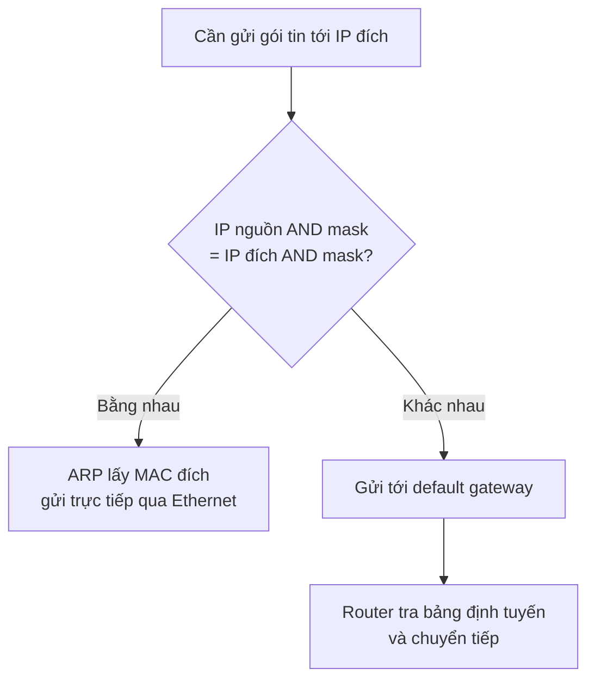
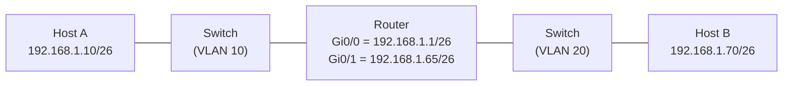
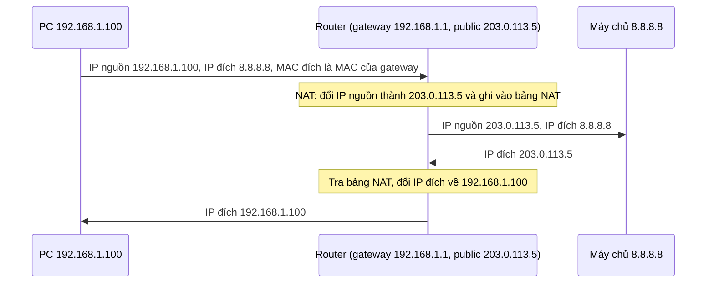

# IPv4: địa chỉ, mạng và chia mạng con — từ classful đến classless

Toàn bộ chuyện chia mạng con (subnetting) xuất phát từ một ràng buộc kép: không gian địa chỉ hữu hạn, và cơ chế quảng bá (broadcast) không mở rộng tốt (tiếng Anh hay nói "broadcast domains don't scale"). Câu này không có nghĩa là về nguyên tắc không thể làm miền quảng bá to hơn, mà là càng to thì chi phí càng cao đến mức không chấp nhận được (xem mục "Mạng IP là một miền quảng bá"). Hai ràng buộc này giải thích vì sao mô hình địa chỉ đổi từ classful sang classless, và vì sao ta phải tính toán prefix thay vì cấp phát tùy tiện.

Lộ trình của bài: không gian địa chỉ → mạng IP và miền quảng bá → mặt nạ mạng (cách thiết bị phân biệt "cùng mạng" và "khác mạng") → chia một khối thành nhiều subnet → classful và địa chỉ đặc biệt → vì sao classful lãng phí → classless (VLSM, CIDR) → NAT, default gateway và IPv6.

## Không gian 32 bit: hữu hạn và đã cạn

Internet Protocol address (IP address – địa chỉ IP) là định danh của một điểm đầu cuối trong giao tiếp dựa trên IP. IPv4 dùng 32 bit, nên có đúng 2³² = 4.294.967.296 địa chỉ [1].

Về chuyện "cạn kiệt", chúng ta cần chính xác hơn so với cách nói chung chung:

- Internet Assigned Numbers Authority (IANA – cơ quan cấp phát số hiệu Internet) cấp hai khối /8 chưa dự trữ cuối cùng cho APNIC ngày 31/01/2011, rồi chia năm khối /8 còn lại, mỗi Regional Internet Registry (RIR – cơ quan đăng ký Internet khu vực) một khối, ngày 03/02/2011 [2].
- Sau đó, từng RIR cạn kho địa chỉ cấp phát thông thường vào các thời điểm khác nhau [3]:

| RIR | Khu vực | Thời điểm cạn |
|---|---|---|
| APNIC | Châu Á – Thái Bình Dương | 15/04/2011 |
| LACNIC | Mỹ Latinh – Caribbean | 10/06/2014 |
| ARIN | Bắc Mỹ | 24/09/2015 |
| AfriNIC | Châu Phi | 21/04/2017 |
| RIPE NCC | Châu Âu, Trung Đông, Trung Á | 25/11/2019 |

✦ Suy luận: mốc "tháng 4 năm 2017" mà nhiều tài liệu nhắc tới khớp với AfriNIC chứ không phải một sự kiện toàn cầu. Một nguồn khác lại xếp AfriNIC vào giai đoạn cấp phát cuối năm 2020 [5], nghĩa là "cạn" phụ thuộc vào định nghĩa (hết kho thông thường hay hết hẳn).

Sau cạn kiệt, địa chỉ mới chỉ còn đến từ địa chỉ thu hồi, danh sách chờ và thị trường chuyển nhượng [3][4]. Vậy việc dùng từng địa chỉ cho khéo không phải chuyện lý thuyết, và nó dẫn thẳng đến câu hỏi: địa chỉ phải được nhóm thành mạng như thế nào.

## Mạng IP là một miền quảng bá

Một mạng IP (IP network) là nhóm địa chỉ cùng một broadcast domain (miền quảng bá – phạm vi mà mọi thiết bị đều nhận bản sao gói quảng bá) và không cần router để nói chuyện với nhau [1].

### Các thuật ngữ nền

Trước khi đi tiếp, ta thống nhất vài thuật ngữ sẽ dùng lại nhiều lần:

- Media Access Control address (MAC address – địa chỉ phần cứng gắn với card mạng, gồm 48 bit, dùng để xác định thiết bị khi gửi dữ liệu trong cùng một mạng cục bộ). IP là địa chỉ "logic" có thể đổi theo cấu hình, còn MAC là địa chỉ gắn với phần cứng.
- Frame (khung dữ liệu): đơn vị dữ liệu ở tầng Ethernet. Mỗi frame mang MAC nguồn và MAC đích, còn gói tin IP nằm bên trong frame.
- Switch (bộ chuyển mạch): thiết bị nối các host trong cùng một mạng cục bộ (Local Area Network – LAN). ✦ Diễn giải: switch chuyển frame dựa trên MAC đích, không đọc địa chỉ IP.
- Router (bộ định tuyến): thiết bị nối các mạng IP khác nhau. ✦ Diễn giải: router đọc địa chỉ IP đích và tra bảng định tuyến để chọn đường.
- Default gateway (cổng mặc định): địa chỉ IP của một interface của router nằm trong cùng subnet với host. Host gửi mọi gói tin có đích ngoài mạng của mình đến địa chỉ này [1].
- Host (thiết bị đầu cuối): máy tính, điện thoại, máy chủ, hay bất kỳ thiết bị nào có địa chỉ IP.

✦ Diễn giải: một host cần tối thiểu ba thông số để dùng IP bình thường: địa chỉ IP, mặt nạ mạng (mask), và default gateway. Thiếu gateway thì host vẫn nói chuyện được với host cùng mạng, nhưng không ra được ngoài mạng.

### Cùng subnet: giao tiếp trực tiếp qua switch

Câu "cùng subnet thì giao tiếp trực tiếp qua chuyển mạch Ethernet, không qua router" [1] nghĩa là gì, từng bước? Giả sử host A (192.168.1.10) muốn gửi cho host B (192.168.1.20), cùng một subnet, cắm chung một switch:

1. A xác định B cùng mạng với mình (cách xác định ở mục tiếp theo).
2. A cần MAC của B nên gửi một gói ARP request quảng bá: "ai có IP 192.168.1.20?". Address Resolution Protocol (ARP – giao thức phân giải địa chỉ, tức hỏi "IP này ứng với MAC nào?") [1]. Switch chuyển bản sao request ra mọi cổng trong miền quảng bá.
3. B nhận được, trả lời trực tiếp cho A kèm MAC của B.
4. A tạo frame có MAC đích = MAC của B, rồi gửi đi. ✦ Diễn giải: switch tra bảng MAC của nó và chuyển frame chỉ ra cổng nối với B.

Điểm mấu chốt: không thiết bị nào trên đường đi cần đọc hay quyết định gì dựa trên địa chỉ IP. Mọi thứ diễn ra ở tầng Ethernet, nên không có router. Tài liệu gọi mô hình "hỏi cả miền rồi học MAC" này là flood-and-learn (tràn gói tin rồi học địa chỉ) [1].

### Khác subnet: phải qua router

Nếu B ở subnet khác, A không ARP để hỏi MAC của B. Thay vào đó A gửi gói tin cho default gateway, và router chuyển tiếp theo bảng định tuyến [1]. Router chấm dứt kiểu flood-and-learn và đưa vào cơ chế chọn đường [1]. Ba quy tắc cần thuộc [1]:

- Một subnet = một miền quảng bá = một Virtual Local Area Network (VLAN – mạng LAN ảo, tức một mạng LAN logic tách bằng cấu hình thay vì cáp).
- Cùng subnet: giao tiếp trực tiếp qua chuyển mạch Ethernet, không qua router.
- Khác subnet: phải qua một hay nhiều router, giao tiếp bằng định tuyến IP.

Quy tắc thứ ba áp dụng cả khi hai subnet cùng được chia ra từ một khối địa chỉ mà bạn sở hữu. Lý do được giải thích đầy đủ ở mục "Chia một khối thành nhiều subnet" bên dưới.

### Vì sao không gom mọi thiết bị vào một mạng

Ý "broadcast không mở rộng tốt" nằm ở chi phí của quảng bá:

- Mỗi gói ARP request đến mọi host trong miền, kể cả các host chẳng liên quan [1].
- ✦ Suy luận: lượng quảng bá mà mỗi host phải nhận tăng theo số host trong miền, nên môi trường truyền bị quá tải ở quy mô lớn. ✦ Ví dụ minh họa: miền có 1.000 host, mỗi host phát 1 gói quảng bá mỗi giây, thì mỗi host phải xử lý khoảng 1.000 gói quảng bá mỗi giây không dành cho mình. Nhân con số đó lên cho cả hành tinh thì không còn chỗ cho dữ liệu thật.
- Router là điểm cắt: nó không chuyển tiếp quảng bá, và thay vào đó chọn đường theo bảng định tuyến [1].

✦ Heuristic: con số "dưới 255 host mỗi miền quảng bá" trong tài liệu gốc [1] là quy ước thực hành, không phải giới hạn của chuẩn. Thực tế phụ thuộc vào lưu lượng quảng bá và thiết kế VLAN.

Câu hỏi còn lại là thiết bị biết một IP đích "cùng mạng" hay "khác mạng" bằng cách nào. Đó là việc của mặt nạ mạng.

## Mặt nạ mạng, prefix và phép AND bit

Network mask (mặt nạ mạng) cho thiết bị biết phần nào của địa chỉ là phần mạng, phần nào là phần host [1]. Các bit 1 của mặt nạ đánh dấu phần mạng, các bit 0 đánh dấu phần host. Mặt nạ có thể viết dạng thập phân (255.255.255.0) hoặc dạng prefix (/24, nghĩa là có 24 bit 1 liên tiếp từ trái sang).

### Địa chỉ mạng, địa chỉ quảng bá và host khả dụng

Trong mỗi mạng, hai địa chỉ không gán được cho host [14]:

- Địa chỉ mạng (network address): phần host toàn bit 0. Đây là "tên" của mạng.
- Địa chỉ quảng bá (broadcast address): phần host toàn bit 1. Gửi tới địa chỉ này là gửi cho mọi host trong mạng.

Vì vậy số host khả dụng là 2ⁿ − 2, với n là số bit host. ✦ Ví dụ minh họa: mạng 192.168.1.0/24 có 8 bit host, nên 256 địa chỉ: .0 là địa chỉ mạng, .255 là địa chỉ quảng bá, host dùng .1 đến .254 (254 địa chỉ).

Bảng tra nhanh cho các prefix hay gặp (tính từ công thức trên):

| Prefix | Mask | Số bit host | Tổng địa chỉ | Host khả dụng | Bước nhảy (block size) ở octet cuối |
|---|---|---|---|---|---|
| /24 | 255.255.255.0 | 8 | 256 | 254 | 256 |
| /25 | 255.255.255.128 | 7 | 128 | 126 | 128 |
| /26 | 255.255.255.192 | 6 | 64 | 62 | 64 |
| /27 | 255.255.255.224 | 5 | 32 | 30 | 32 |
| /28 | 255.255.255.240 | 4 | 16 | 14 | 16 |
| /29 | 255.255.255.248 | 3 | 8 | 6 | 8 |
| /30 | 255.255.255.252 | 2 | 4 | 2 | 4 |

✦ Heuristic: bước nhảy = 256 trừ giá trị octet của mask. Các subnet bắt đầu tại bội số của bước nhảy: với /26 thì 0, 64, 128, 192. Các prefix /31 và /32 là trường hợp đặc biệt, xem mục classless.

### Cách thiết bị quyết định: AND bit

✦ Diễn giải: về mặt thao tác, thiết bị áp mặt nạ của chính nó lên cả địa chỉ nguồn và địa chỉ đích bằng phép AND bit, rồi so hai kết quả.

Phép AND bit: ở mỗi vị trí bit, kết quả là 1 chỉ khi cả hai bit đều là 1. Vì mask có bit 1 ở phần mạng, bit 0 ở phần host, AND với mask giữ nguyên phần mạng và xóa sạch phần host về 0. Kết quả chính là địa chỉ mạng.

### Ví dụ chi tiết: host 10.4.21.43, mask 255.0.0.0

✦ Ví dụ minh họa. Trước hết đổi sang nhị phân (mỗi octet 8 bit):

| | Octet 1 | Octet 2 | Octet 3 | Octet 4 |
|---|---|---|---|---|
| Host 10.4.21.43 | 00001010 | 00000100 | 00010101 | 00101011 |
| Mask 255.0.0.0 | 11111111 | 00000000 | 00000000 | 00000000 |
| Host AND mask | 00001010 | 00000000 | 00000000 | 00000000 |

Kết quả AND là 10.0.0.0, tức host này thuộc mạng 10.0.0.0/8. Bây giờ host muốn gửi tới hai đích khác nhau. Mask của host vẫn là 255.0.0.0, nên với mỗi đích ta AND với mask đó:

| Đích | Octet 1 của đích | AND mask | Kết quả | So với 10.0.0.0 |
|---|---|---|---|---|
| 10.122.45.155 | 00001010 | 00001010 | 10.0.0.0 | Giống, cùng mạng |
| 13.1.2.3 | 00001101 | 00001101 | 13.0.0.0 | Khác, khác mạng |

Chỉ octet đầu cần xét vì ba octet sau của mask toàn 0, nên AND luôn cho 0 bất kể giá trị. Từ kết quả đó, hành động của host khác nhau:

| | Đích 10.122.45.155 | Đích 13.1.2.3 |
|---|---|---|
| Quyết định | Cùng mạng | Khác mạng |
| Host ARP hỏi ai? | Hỏi chính IP đích 10.122.45.155 | Hỏi MAC của default gateway (ví dụ 10.0.0.1, ✦ giả định) |
| MAC đích của frame | MAC của 10.122.45.155 | MAC của gateway |
| IP đích của gói tin | 10.122.45.155 | 13.1.2.3 |
| Ai nhận frame đầu tiên | Chính máy đích (qua switch) | Router (gateway) |

Hàng thứ ba và thứ tư của bảng là điểm hay bị nhầm: khi đi qua gateway, IP đích vẫn là đích cuối cùng, nhưng MAC đích là của gateway. ✦ Diễn giải: MAC chỉ có ý nghĩa trong từng chặng (hop) Ethernet và được thay ở mỗi router, còn IP đích giữ nguyên suốt đường đi.

### Mask không rơi đúng ranh giới octet

Với mask không rơi đúng ranh giới octet, phép AND vẫn y như vậy, chỉ khó nhẩm hơn. ✦ Ví dụ minh họa: 10.1.1.2 với mask 255.255.224.0 (/19). Hai octet đầu của mask đều là 255 nên giữ nguyên 10.1. Octet thứ ba: 1 = 00000001, 224 = 11100000, AND cho 00000000 = 0. Octet thứ tư của mask là 0 nên về 0. Vậy mạng là 10.1.0.0/19. Bước nhảy là 256 − 224 = 32, nên mạng này trải từ 10.1.0.0 đến 10.1.31.255, với 2¹³ − 2 = 8.190 host khả dụng.

Ở mô hình classful, mask không cần khai báo vì nó được suy ra từ chính địa chỉ. Trước khi xem mô hình đó, ta trả lời một câu hỏi hay gặp khi bắt đầu chia mạng.

## Chia một khối thành nhiều subnet: vì sao vẫn phải qua router?

Câu hỏi: nếu tôi có khối 192.168.1.0/24 rồi chia thành các subnet nhỏ bên trong, các subnet đó vẫn phải giao tiếp qua router sao? Có, và lý do nằm ở chỗ hai nghĩa của từ "mạng":

- Khối địa chỉ bạn được cấp (allocation): chỉ là quyền dùng một dải địa chỉ liên tiếp. Nó không tự quyết định ranh giới mạng.
- Mạng IP (subnet): ranh giới thật được quyết định bởi mask mà bạn cấu hình trên host và interface. Theo quy tắc ở trên, mỗi subnet là một miền quảng bá riêng [1].

Nên khi bạn đặt mask /26 cho các host, khối 192.168.1.0/24 không còn là một mạng nữa. Nó là bốn mạng độc lập mà tình cờ có địa chỉ liền kề nhau.

Một lưu ý nhỏ: 192.168.1.0/24 thuộc dải private của RFC 1918 [7], nên bạn không phải mua. Nguyên lý ở đây áp dụng y như vậy cho khối public.

### Ví dụ: chia 192.168.1.0/24 thành bốn subnet /26

✦ Ví dụ minh họa. Mỗi /26 có 64 địa chỉ, 62 host khả dụng. Lấy địa chỉ đầu tiên khả dụng làm gateway (một thói quen phổ biến, không phải bắt buộc):

| Subnet | Địa chỉ mạng | Host khả dụng | Địa chỉ quảng bá | Gateway (giả định) |
|---|---|---|---|---|
| 1 | 192.168.1.0/26 | .1 – .62 | .63 | 192.168.1.1 |
| 2 | 192.168.1.64/26 | .65 – .126 | .127 | 192.168.1.65 |
| 3 | 192.168.1.128/26 | .129 – .190 | .191 | 192.168.1.129 |
| 4 | 192.168.1.192/26 | .193 – .254 | .255 | 192.168.1.193 |

Giả sử host A là 192.168.1.10/26 (subnet 1) và host B là 192.168.1.70/26 (subnet 2). Mạng nối như sau:

Quyết định của A, trong octet cuối (mask /26 là 255.255.255.192, tức 11000000 ở octet cuối):

| | Octet cuối dạng nhị phân | AND 11000000 | Mạng |
|---|---|---|---|
| A: .10 | 00001010 | 00000000 = 0 | 192.168.1.0 |
| B: .70 | 01000110 | 01000000 = 64 | 192.168.1.64 |

Hai kết quả khác nhau, nên A coi B là khác mạng và gửi cho gateway 192.168.1.1. Router nhận ở interface Gi0/0, tra bảng thấy mạng 192.168.1.64/26 nối trực tiếp với Gi0/1, rồi ARP hỏi MAC của B và gửi ra. Nếu cả hai host đều dùng mask /24, phép AND cho cùng 192.168.1.0, và chúng nói chuyện trực tiếp, không qua router.

Điều này cho thấy hai điểm:

- Quyết định "qua router hay không" là của host, dựa trên mask, không dựa trên vị trí vật lý của host. Hai host cắm chung một switch nhưng có mask /26 và khác subnet vẫn gửi nhau qua gateway.
- Đó là mục đích của việc chia subnet: mỗi subnet là một miền quảng bá riêng, và router là ranh giới giữa chúng [1].

✦ Diễn giải: "router" ở đây là chức năng định tuyến, và có thể do một router thật hoặc một Layer 3 switch (switch có khả năng định tuyến) đảm nhận. Ngoài ra, để các subnet thực sự cách ly quảng bá, chúng phải nằm trên các VLAN riêng (như hình). Nếu cắm các subnet khác nhau vào cùng một VLAN, host vẫn đi qua gateway để sang subnet khác, nhưng quảng bá vẫn tràn chung một miền và ta mất lợi ích cách ly.

## Mô hình classful và những vùng địa chỉ đặc biệt

Mô hình classful xuất hiện trong đặc tả IP năm 1981 (RFC 791) và chia không gian thành năm lớp [6]. Lớp quyết định mask, nên địa chỉ ngụ ý mask [1]:

| Lớp | Bit đầu | Mask | Dải địa chỉ | Số mạng (dùng được) | Host khả dụng/mạng |
|---|---|---|---|---|---|
| A | 0 | /8 | 1.0.0.0 – 126.255.255.255 | 126 | 16.777.214 |
| B | 10 | /16 | 128.0.0.0 – 191.255.255.255 | 16.384 | 65.534 |
| C | 110 | /24 | 192.0.0.0 – 223.255.255.255 | 2.097.152 | 254 |
| D | 1110 | — | 224.0.0.0 – 239.255.255.255 | Multicast | — |
| E | 1111 | — | 240.0.0.0 – 255.255.255.255 | Dự trữ | — |

Cách nhận ra lớp là nhìn vài bit đầu của octet đầu tiên [6]. ✦ Ví dụ minh họa: 192 = 11000000, bắt đầu bằng 110, nên 192.168.1.45 thuộc lớp C và mask mặc định là /24. Với 144 = 10010000, bắt đầu bằng 10, nên 144.1.32.45 thuộc lớp B và mask là /16.

Các số "dùng được" ở trên lệch nhẹ so với bảng trong tài liệu gốc [1] vì hai lý do [6][14]:

- 0.0.0.0/8 và 127.0.0.0/8 thuộc dải lớp A nhưng bị dự trữ, nên lớp A chỉ có 126 mạng dùng được thay vì 128.
- Trong mỗi mạng, hai địa chỉ không gán cho host (địa chỉ mạng và địa chỉ quảng bá), nên số host là 2ⁿ − 2.

### Các khối địa chỉ đặc biệt cần biết

| Khối | Mục đích | Ghi chú |
|---|---|---|
| 0.0.0.0/8 | Dự trữ [6] | Địa chỉ 0.0.0.0 còn gặp trong bảng định tuyến như default route (tuyến mặc định) [15] |
| 127.0.0.0/8 | Loopback [6] | Giải thích ngay bên dưới |
| 10.0.0.0/8, 172.16.0.0/12, 192.168.0.0/16 | Private (RFC 1918) [7] | Không định tuyến được trên Internet công cộng |
| 100.64.0.0/10 | Shared address space (RFC 6598) [11] | Dùng cho Carrier-Grade NAT, không định tuyến toàn cầu |
| 169.254.0.0/16 | Link-local (RFC 3927) [18] | Host tự gán khi không lấy được địa chỉ từ DHCP; không được router chuyển tiếp |
| 224.0.0.0/4 | Multicast (lớp D) [1] | Gửi cho một nhóm thiết bị |
| 240.0.0.0/4 | Dự trữ (lớp E) [1] | Không dùng cho host |

### Loopback là gì

Loopback (vòng lặp nội bộ) là địa chỉ mà một thiết bị dùng để nói chuyện với chính nó. Gói tin gửi tới địa chỉ loopback không ra khỏi máy và không đi qua mạng. ✦ Diễn giải: hệ điều hành chuyển ngay gói tin trở lại tầng mạng của chính nó.

- Toàn bộ khối 127.0.0.0/8 dành cho loopback, và không thể cấp cho một mạng thật [6]. Địa chỉ thường dùng nhất là 127.0.0.1, tên thường gọi là localhost.
- Cách dùng thứ nhất, kiểm tra ngăn xếp TCP/IP của máy: `ping 127.0.0.1` thành công nghĩa là phần mềm giao thức IP trên máy đang hoạt động [15]. Nó không kiểm tra cáp hay card mạng, vì gói tin không ra ngoài.
- Cách dùng thứ hai, ✦ Heuristic: khi lập trình, chạy một dịch vụ cục bộ (ví dụ máy chủ web thử nghiệm) rồi truy cập qua `localhost:8080`. Khi đó trình duyệt và máy chủ nói chuyện với nhau trong cùng một máy.
- Một nghĩa khác cùng tên, ✦ Heuristic: trên router, loopback interface là một interface ảo luôn ở trạng thái hoạt động và có thể được gán địa chỉ bất kỳ, thường là một địa chỉ /32 để định danh router. Đừng nhầm nó với khối 127.0.0.0/8.

Vấn đề của classful không nằm ở cơ chế mà ở độ thô của ba cỡ mạng, như phần sau cho thấy.

## Khi ba cỡ khối quá thô

Bài toán trong tài liệu gốc: công ty bán lẻ có 50 cửa hàng, mỗi cửa hàng 10 host, và mỗi cửa hàng nối về trụ sở bằng một đường truyền Wide Area Network (WAN – mạng diện rộng, tức đường nối các site ở xa nhau) [1]. Ta đi từng bước.

### Bước 1: đếm số mạng cần

Theo ba quy tắc ở trên, mỗi subnet là một miền quảng bá riêng và bị router ngăn cách [1]. Từ đó:

- Mỗi cửa hàng cần một mạng cho LAN của nó: 50 mạng.
- Mỗi đường WAN nối router trụ sở với router cửa hàng cũng là một mạng riêng, vì hai đầu của đường này là hai router (ranh giới giữa các subnet). Có 50 đường, nên thêm 50 mạng.
- Tổng cộng là 100 mạng, và tài liệu gốc nói "ít nhất" vì thực tế còn cần mạng cho chính trụ sở [1].

### Bước 2: classful buộc mỗi mạng là một khối /24

Trong classful, kích thước mạng cố định theo lớp, và khối nhỏ nhất cho một mạng host là lớp C, tức 256 địa chỉ [1]. Không có cách cắt nhỏ hơn. Do đó, 100 mạng cần 100 khối lớp C, và 100 × 256 = 25.600 địa chỉ [1].

### Bước 3: so với nhu cầu thật

Số địa chỉ thực sự dùng: 50 × 10 = 500 host, cộng thêm 2 đầu router cho mỗi đường WAN, tức 100 địa chỉ. Tổng khoảng 600 (chưa tính địa chỉ gateway). Tỷ lệ sử dụng: 600 / 25.600 ≈ 2,3%. Phần còn lại bị khóa trong các khối quá lớn. Đường WAN là ví dụ rõ nhất: nó chỉ có 2 đầu mà chiếm trọn một khối 256 địa chỉ [1].

Một hệ quả thứ hai, sẽ được nói ở mục CIDR: cấp nhiều khối lớp C rời rạc cho một tổ chức làm bảng định tuyến toàn cầu phình ra, và đây là một động lực trực tiếp của CIDR [9].

### Bước 4: cắt khối đúng cỡ (classless)

✦ Ví dụ minh họa: nếu được chọn cỡ khối theo nhu cầu, ta tính như sau.

- LAN mỗi cửa hàng: 10 host + 1 địa chỉ gateway = 11 địa chỉ khả dụng. Cộng 2 địa chỉ (mạng và quảng bá) là 13. Lũy thừa của 2 nhỏ nhất không nhỏ hơn 13 là 16 = 2⁴, nên cần 4 bit host, prefix /28 (14 host khả dụng). 50 cửa hàng tốn 50 × 16 = 800 địa chỉ.
- Mỗi đường WAN: chỉ có 2 đầu, nên cần 2 địa chỉ khả dụng. Cộng 2 địa chỉ (mạng và quảng bá) là 4 = 2², nên cần 2 bit host, prefix /30 (32 − 2 = 30). 50 đường tốn 50 × 4 = 200 địa chỉ, đó chính là con số "tốn thêm 200".
- Tổng: 800 + 200 = 1.000 địa chỉ, so với 25.600 của classful: ít hơn khoảng 25,6 lần.
- Nếu dùng /31 cho đường WAN theo RFC 3021 [10] (xem mục sau), mỗi đường chỉ tốn 2 địa chỉ, tổng WAN là 100 và tổng cộng là 900.

| Cách cấp | LAN (50 cửa hàng) | WAN (50 đường) | Tổng |
|---|---|---|---|
| Classful (/24 mỗi mạng) | 12.800 | 12.800 | 25.600 |
| Classless, /28 và /30 | 800 | 200 | 1.000 |
| Classless, /28 và /31 | 800 | 100 | 900 |

Muốn cắt khối theo nhu cầu như vậy, mask phải thôi bị ràng buộc với lớp. Đó là bước chuyển sang classless.

## Classless: VLSM và CIDR

Từ đây trở đi, địa chỉ luôn được viết kèm prefix: a.b.c.d/n, với n là số bit phần mạng. Trong classless, địa chỉ không còn ngụ ý mask, ta phải khai báo mask tường minh. Chẳng hạn 10.1.1.2 có thể là /8, /24 hay /19 [1].

- Variable-Length Subnet Masking (VLSM – mặt nạ mạng con có độ dài thay đổi): cho phép chia một khối thành các subnet có kích thước khác nhau, mỗi subnet có prefix riêng [1]. Bài toán 50 cửa hàng ở trên, dùng /28 cho LAN và /30 cho WAN trong cùng một khối, chính là VLSM.
- Classless Inter-Domain Routing (CIDR – cách đánh địa chỉ và cấp phát không phân lớp): áp dụng cùng ý tưởng ở quy mô Internet. Mọi khối được cấp và nhận diện bằng prefix, nên nhà cung cấp dịch vụ có thể cấp cho khách đúng một khối /27 hay /22 thay vì cả một khối lớp C hay B [9].

CIDR ra đời năm 1993 (RFC 1519, sau được thay bởi RFC 4632), một phần để hãm tốc độ phình của bảng định tuyến [4][9]. Chỉ nói sơ qua phần định tuyến, vì chủ đề của bài là IP: khi các khối được cấp liền kề nhau, router phía ngoài chỉ cần nhớ một mục chung thay vì một mục cho từng khách hàng (gọi là gom tuyến, route aggregation) [9]. ✦ Ví dụ minh họa: nhà cung cấp có khối 200.1.0.0/16 và cấp 200.1.1.0/24, 200.1.2.0/24, và các khối khác cho khách hàng. Phần còn lại của Internet chỉ cần biết "muốn tới 200.1.x.x thì gửi về nhà cung cấp này". Cơ chế chi tiết thuộc về định tuyến và ngoài phạm vi bài này.

### Cắt khối theo cỡ: bài toán 32 / 16 / 16 host

Đề bài trong tài liệu gốc: khối 200.1.1.0/24, ba cửa hàng cần 32, 16 và 16 host [1]. Cái bẫy ở đây là mỗi subnet mất 2 địa chỉ cho địa chỉ mạng và quảng bá, nên "32 host" cần ít nhất 34 địa chỉ, tức là 64:

| Cửa hàng | Host cần | Cần tối thiểu | Prefix | Khối được cấp | Host khả dụng |
|---|---|---|---|---|---|
| New York | 32 | 34 → 64 | /26 | 200.1.1.0/26 | .1 – .62 |
| Cửa hàng 2 | 16 | 18 → 32 | /27 | 200.1.1.64/27 | .65 – .94 |
| Cửa hàng 3 | 16 | 18 → 32 | /27 | 200.1.1.96/27 | .97 – .126 |

✦ Ví dụ minh họa: phần còn lại 200.1.1.128/25 (128 địa chỉ) để dành cho tăng trưởng hoặc link WAN. ✦ Heuristic: cấp khối lớn nhất trước, và mỗi khối kích thước 2ᵏ phải bắt đầu tại bội số của 2ᵏ.

### Các trường hợp biên của prefix

- Công thức chung: số host khả dụng = 2^(32 − n) − 2 với prefix /n khi n ≤ 30.
- /31: hai địa chỉ. Áp công thức 2ⁿ − 2 một cách máy móc cho 0 host, nên RFC 3021 cho phép cả hai làm địa chỉ host trên link điểm-điểm, nơi không cần quảng bá. Thiết bị phải hỗ trợ (ví dụ Linux, Cisco IOS 12.2 trở lên) [10].
- /32: một địa chỉ duy nhất. ✦ Heuristic: dùng để chỉ đúng một thiết bị hay một interface, chẳng hạn loopback interface của router.

### So sánh và đánh đổi

| Tiêu chí | Classful | Classless |
|---|---|---|
| Mask | Cố định theo lớp, suy ra từ địa chỉ [1] | Tùy ý, phải khai báo tường minh [1] |
| Độ vừa khít với nhu cầu | Thấp, lãng phí khối lớn [1] | Cao, chọn cỡ khối theo nhu cầu [1] |
| Quy mô bảng định tuyến | Phình do nhiều khối rời rạc [9] | Gom được nếu cấp phát liền kề [9] |
| Công sức thiết kế | Thấp | Cao hơn: phải tính prefix, căn lề khối, ghi chép cấp phát |

✦ Heuristic: chi phí thật của classless là độ phức tạp vận hành: dễ cấp chồng lấn, dễ sai prefix, và đòi hỏi kế hoạch cấp phát có hệ thống.

Dù classless dùng địa chỉ khéo hơn rất nhiều, nó không tạo thêm địa chỉ nào. Phần cuối nói về những giải pháp đi cùng.

## Kéo dài tuổi thọ IPv4: private, NAT, default gateway và IPv6

Có ba cơ chế chính, dùng phối hợp:

- CIDR: giảm lãng phí và giảm tốc độ phình bảng định tuyến [4][9].
- Địa chỉ private (RFC 1918) cộng Network Address Translation (NAT – dịch địa chỉ mạng, tức viết lại địa chỉ trong gói tin khi nó đi qua router): nhiều thiết bị dùng chung một địa chỉ public [7][8]. NAT được đề xuất như giải pháp tạm thời từ RFC 1631 năm 1994 [12].
- Carrier-Grade NAT (CGNAT – NAT cấp nhà mạng): xem cuối mục.

### Vì sao cần NAT: địa chỉ private không ra được Internet

Địa chỉ private chỉ có ý nghĩa trong mạng nội bộ. Các mạng khác nhau có thể dùng lại cùng một dải private, và bộ định tuyến trên Internet không có tuyến để đưa gói về đúng mạng private đó [11]. Vì vậy router ở biên mạng phải chặn hoặc dịch các địa chỉ này [11]. NAT là phần "dịch".

### NAT và default gateway liên quan thế nào

Có, rất liên quan. Hãy theo dấu một gói tin ra Internet. ✦ Ví dụ minh họa: PC 192.168.1.100/24, gateway 192.168.1.1, router có địa chỉ public 203.0.113.5 ở phía Internet, máy chủ đích 8.8.8.8:

Từng bước:

1. PC áp mask /24 lên 8.8.8.8, thấy khác mạng, nên gửi cho default gateway (như mục AND bit ở trên). PC không biết gì về NAT.
2. Router nhận gói tin tại interface phía LAN. Trước khi chuyển ra interface phía Internet, router viết lại địa chỉ nguồn từ địa chỉ private sang địa chỉ public của nó, và ghi lại ánh xạ này trong bảng dịch (translation table) [16].
3. Máy chủ chỉ thấy địa chỉ public. Khi trả lời, gói tin đi về địa chỉ public đó.
4. Router tra bảng, khôi phục địa chỉ private, và chuyển vào LAN: ARP hỏi MAC của PC, rồi gửi frame cho PC [16].

Vậy mối liên hệ nằm ở vị trí: NAT chạy trên router ở biên, nơi có một chân trong mạng private và một chân ra Internet [17]. Ở nhà hay văn phòng nhỏ, thiết bị này thường chính là default gateway của LAN (router Wi-Fi). ✦ Diễn giải: không phải lúc nào cũng vậy. Trong mạng lớn, gateway của một VLAN có thể là một Layer 3 switch bên trong, còn NAT được làm ở firewall hay router ngoài rìa. Hai vai trò "gateway" và "thiết bị NAT" chỉ trùng nhau khi cùng một thiết bị đảm nhận cả hai.

### Nhiều thiết bị chung một địa chỉ public: PAT

Nếu chỉ đổi địa chỉ, ánh xạ sẽ là một-một và cần nhiều địa chỉ public. Để nhiều thiết bị dùng chung một địa chỉ, router dùng Port Address Translation (PAT – dịch địa chỉ kèm số hiệu cổng, còn gọi là NAT overload): nó viết lại cả địa chỉ nguồn lẫn số hiệu cổng (port number – số phân biệt các kết nối trên một thiết bị) nguồn thành một cổng duy nhất cho mỗi kết nối, và ghi cả cặp địa chỉ-cổng gốc lẫn cặp địa chỉ-cổng đã dịch vào bảng [16]. Khi gói trả lời về, router nhìn cổng đích để biết phải trả về host nào [16]. Đây là kiểu NAT mà gần như mọi mạng gia đình và chi nhánh dùng [17].

Hai hệ quả cần biết [16]: kết nối đến từ bên ngoài mà không có mục tương ứng trong bảng sẽ bị bỏ, nên NAT che bớt các host bên trong (nhưng không thay thế được firewall). Và khi quá nhiều kết nối đồng thời dùng chung một địa chỉ public, số hiệu cổng có thể cạn (port exhaustion). ✦ Heuristic: số hiệu cổng dài 16 bit nên mỗi địa chỉ public có tối đa khoảng 65 nghìn cổng.

### Carrier-Grade NAT và cái giá của NAT

Carrier-Grade NAT (CGNAT – NAT cấp nhà mạng): nhà cung cấp dịch vụ cấp địa chỉ 100.64.0.0/10 cho khách hàng rồi NAT ở phía mình, nên khách hàng có thể bị NAT hai lớp [11][13]. Cái giá của NAT là mất kết nối đầu-cuối (end-to-end): các ứng dụng đặt địa chỉ IP trong payload (phần dữ liệu của gói tin), như VoIP hay IPsec, khó hoạt động đúng [8].

### IPv6

IPv6 giải quyết tận gốc bằng địa chỉ 128 bit, khoảng 3,4 × 10³⁸ địa chỉ [13]. IPv6 được chuẩn hóa năm 1998 (RFC 2460) và được hợp nhất lại thành RFC 8200 năm 2017 [12]. ✦ Diễn giải: khái niệm prefix và tổng hợp tuyến của CIDR vẫn được dùng trong IPv6, nên kỹ năng tính prefix ở IPv4 chuyển sang được.

## Tóm tắt để ôn

- IPv4 có 2³² địa chỉ và đã hết kho cấp phát thông thường; mốc cạn khác nhau theo từng RIR.
- Một subnet = một miền quảng bá = (thường) một VLAN. Cùng subnet thì đi qua switch bằng MAC; khác subnet thì đi qua router bằng IP, kể cả khi hai subnet được chia ra từ cùng một khối.
- Thiết bị tự quyết định "cùng mạng hay không" bằng AND mask với địa chỉ nguồn và đích. Khác mạng thì gửi tới default gateway; IP đích giữ nguyên, MAC đích là của gateway.
- Mỗi mạng mất 2 địa chỉ (mạng và quảng bá), host khả dụng = 2ⁿ − 2. Ngoại lệ /31 cho link điểm-điểm.
- Classful cố định mask theo lớp (A /8, B /16, C /24), nên lãng phí; classless dùng prefix tùy ý (VLSM, CIDR).
- Loopback (127.0.0.0/8) là địa chỉ để máy nói chuyện với chính nó.
- Private + NAT/PAT chạy ở router biên (thường là default gateway) giúp nhiều thiết bị chung một địa chỉ public; IPv6 là lời giải dài hạn.

## Những chỗ cần đọc cẩn thận trong tài liệu gốc

Tài liệu gốc [1] rất tốt cho việc dựng khái niệm, nhưng có vài điểm cần hiệu chỉnh khi ôn thi hoặc dùng làm tham chiếu:

| Điểm trong tài liệu | Vấn đề | Cách hiểu đúng |
|---|---|---|
| IPv4 "chính thức cạn kiệt tháng 4/2017" | Không có một mốc toàn cầu | IANA hết 02/2011; mốc 04/2017 khớp AfriNIC [2][3] |
| Lớp A có 128 mạng | Hai mạng bị dự trữ | 126 mạng dùng được (0/8 và 127/8 bị dự trữ) [6][14] |
| Bảng lớp ghi số địa chỉ mỗi mạng | Tính cả địa chỉ mạng và quảng bá | Host khả dụng là 2ⁿ − 2 |
| Ví dụ lớp C nói "hai octet đầu" là 192.168.1. | Lớp C có ba octet phần mạng | Phải là "ba octet đầu" (mask /24) |
| Ví dụ lớp C được lặp hai lần | Nhiều khả năng là lỗi sao chép | Một lần là đủ |
| Cửa hàng cần "32 host" | Dễ nhầm 32 địa chỉ với 32 host | Cần /26, không phải /27 |
| Viết tắt "VSLM" | Lỗi chính tả | Là VLSM |
| Mạng IP "dưới 255 host" | Quy ước, không phải chuẩn | Xem mục miền quảng bá |

---

## Tài liệu tham khảo

[1] "Why do we need IP Subnetting?," bài học Introduction to IPv4 Subnetting (tài liệu người dùng cung cấp; không ghi rõ tác giả và nguồn xuất bản).

[2] "IPv4 address exhaustion," Wikipedia. [Online]. Available: https://www.wikipedia.com/wiki/IPv4_exhaustion

[3] "IPv4 address exhaustion," EPFL Graph Search. [Online]. Available: https://graphsearch.epfl.ch/en/concept/6852935

[4] "IPv4 exhaustion," WorldIP. [Online]. Available: https://worldip.io/exhaustion

[5] M. E. Akdeniz. (2026, Feb. 3). "Global IPv4 Exhaustion Timeline: A Regional Breakdown," IPv4 Center. [Online]. Available: https://ipv4center.com/blog/global-ipv4-exhaustion-timeline

[6] "Classful network," Wikipedia. [Online]. Available: https://en.wikipedia.org/wiki/Classful_network

[7] "IPv4 Private Address Space and Filtering," ARIN. [Online]. Available: https://www.arin.net/reference/research/statistics/address_filters/

[8] Y. Rekhter, B. Moskowitz, D. Karrenberg, G. J. de Groot, and E. Lear, "Address Allocation for Private Internets," RFC 1918, Feb. 1996 (trang tóm tắt). [Online]. Available: https://ipfyi.com/rfc/1918/

[9] V. Fuller and T. Li, "Classless Inter-domain Routing (CIDR): The Internet Address Assignment and Aggregation Plan," RFC 4632, Aug. 2006 (trang tóm tắt). [Online]. Available: https://ipfyi.com/rfc/4632/; và V. Fuller, T. Li, J. Yu, and K. Varadhan, "CIDR: an Address Assignment and Aggregation Strategy," RFC 1519, Sep. 1993. [Online]. Available: https://datatracker.ietf.org/doc/rfc1519/

[10] "How to Use /31 Subnets on Point-to-Point Links (RFC 3021)," OneUptime. [Online]. Available: https://oneuptime.com/blog/post/2026-03-20-use-31-subnets-point-to-point-rfc3021/view

[11] "Private and Public IPv4 addresses," giáo trình MTAT.08.003, University of Tartu. [Online]. Available: https://courses.cs.ut.ee/all/MTAT.08.003/mat/1int/course/module8/8.1.4.1/8.1.4.1.html

[12] "The lost decade of IPv6," LACNIC Blog. [Online]. Available: https://blog.lacnic.net/en/the-lost-decade-of-ipv6/

[13] "How to Understand IPv4 Address Exhaustion," OneUptime. [Online]. Available: https://oneuptime.com/blog/post/2026-03-20-understand-ipv4-address-exhaustion/view

[14] "All About IP Classes," Union Test Prep. [Online]. Available: https://uniontestprep.com/comptia-a-core-series-exam/resources/all-about-ip-classes-8f330a2b-08ab-42a1-841d-672528698097

[15] H. A. Ameen, "Computer Networks, Lecture 4," Al-Mustaqbal University College, 2021–2022. [Online]. Available: https://uomus.edu.iq/img/lectures21/MUCLecture_2021_112411492.pdf

[16] "PAT — Port Address Translation," Training Camp Glossary. [Online]. Available: https://trainingcamp.com/glossary/pat/

[17] "Cisco NAT and PAT Configuration," ComputingForGeeks. [Online]. Available: https://computingforgeeks.com/cisco-nat-pat-configuration/

[18] "How to Use Link-Local Addresses (169.254.x.x) in IPv4," OneUptime. [Online]. Available: https://oneuptime.com/blog/post/2026-03-20-link-local-addresses-169-254-ipv4/view

---

## Revision History

| Version | Ngày | Thay đổi |
|---|---|---|
| 1 | 2026-10-05 | Initial draft |
| 2 | 2026-10-05 | Sửa theo phản hồi: (1) đổi giải thích MAC address thành "địa chỉ phần cứng của card mạng" và thêm mục thuật ngữ nền (MAC, frame, switch, router, default gateway, host); (2) giải thích từng bước "cùng subnet giao tiếp trực tiếp qua switch, không qua router" và đối chiếu với "khác subnet"; (3) thêm mục "Chia một khối thành nhiều subnet" trả lời vì sao các subnet chia từ cùng khối 192.168.1.0/24 vẫn phải qua router, kèm ví dụ bốn subnet /26 và sơ đồ; (4) làm rõ "broadcast không mở rộng được" nghĩa là không mở rộng tốt (don't scale), kèm ví dụ số; (5) viết lại ví dụ 10.4.21.43/255.0.0.0 với đổi nhị phân, AND từng octet, và bảng hành động (ARP, MAC đích, IP đích); (6) giải thích chi tiết "hơn 100 mạng lớp C" và "/30 tốn thêm 200" theo từng bước, kèm bảng so sánh, sửa phép tính /28 để tính cả địa chỉ gateway; (7) viết lại câu CIDR cho dễ hiểu và rút gọn phần định tuyến, bỏ hàng và đoạn nói về giao thức định tuyến; (8) thêm mục giải thích loopback (127.0.0.0/8, localhost, loopback interface của router); (9) mở rộng NAT: vì sao private không ra Internet, luồng gói tin qua default gateway, PAT, phân biệt gateway và thiết bị NAT; (10) bổ sung: bảng tra nhanh prefix /24–/30, địa chỉ mạng/quảng bá/host khả dụng, cách nhận lớp từ bit đầu, bảng khối địa chỉ đặc biệt (0/8, 127/8, private, 100.64/10, 169.254/16, multicast, dự trữ), mask không rơi ranh giới octet (/19), lưu ý 192.168.x.x là dải private, mục tóm tắt để ôn; (11) thêm nguồn [15]–[18]. |
