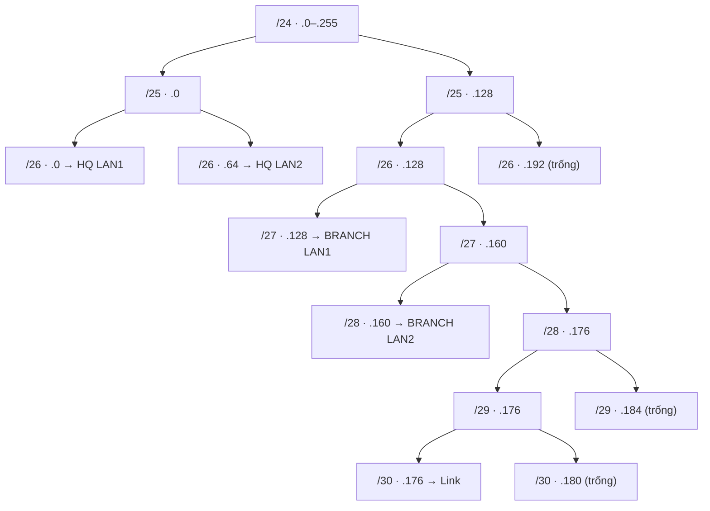

# VLSM từ đầu: sáu cách chia 192.168.40.0/24

## Chia một mảnh đất 256 ô: bối cảnh của bài toán

Hãy hình dung công ty được cấp một mảnh đất gồm 256 ô liền nhau, và phải chia cho năm khu: hai khu 50 người, một khu 30, một khu 12, và một lối đi nối hai trụ sở chỉ cần 2 ô.

- Mỗi "ô" là một địa chỉ Internet Protocol phiên bản 4 → IPv4 → địa chỉ giao thức liên mạng thế hệ thứ 4. Địa chỉ IPv4 có hạn nên tổ chức nào cũng muốn dùng tiết kiệm [2].
- Cách chia đều (Fixed Length Subnet Mask → FLSM → mặt nạ mạng con có độ dài cố định) cho mọi khu cùng một cỡ. Khu 2 người vẫn nhận khối lớn, nên lãng phí. Ví dụ gốc: văn phòng 10 người nhận 64 địa chỉ, bỏ không 54 [1].
- Cách chia theo nhu cầu (Variable Length Subnet Mask → VLSM → mặt nạ mạng con có độ dài thay đổi) cho mỗi khu một cỡ vừa đủ [1].
- Cái giá của VLSM là phải lập kế hoạch cẩn thận hơn, vì chia ẩu sẽ gây phân mảnh [1].

Muốn chia theo nhu cầu, trước hết ta phải đọc được địa chỉ và "cỡ khối" của nó. Phần tiếp theo trang bị những khái niệm đó.

## Nền tảng cần nắm trước khi tính

**Địa chỉ IPv4 và octet**

- Địa chỉ IPv4 gồm 4 số phân cách bằng dấu chấm, ví dụ `192.168.40.176`.
- Mỗi số là một octet (nhóm 8 bit) và có giá trị từ 0 đến 255.
- bit (Binary Digit → bit → chữ số nhị phân, chỉ nhận 0 hoặc 1): 8 bit cho 2⁸ = 256 giá trị.
- Địa chỉ `192.168.40.0/24` thay đổi ở octet cuối, nên ta có 256 địa chỉ để chia (từ .0 đến .255).

**Subnet mask và prefix**

- Subnet mask (mặt nạ mạng con) cho biết bao nhiêu bit đầu thuộc phần "mạng", phần còn lại thuộc phần "host".
- Cách viết ngắn là prefix `/n` (tiền tố độ dài n): `/24` nghĩa là 24 bit đầu thuộc phần mạng.
- Số bit host = 32 − n. Ví dụ `/26` có 32 − 26 = 6 bit host.

**Ba loại địa chỉ trong một subnet**

- Subnet (mạng con): một khối địa chỉ liền nhau, dùng chung phần mạng.
- Subnet ID (Subnet Identifier → Subnet ID → địa chỉ định danh của mạng con): địa chỉ đầu tiên của khối, không gán cho thiết bị.
- Broadcast (địa chỉ quảng bá): địa chỉ cuối của khối, cũng không gán cho thiết bị.
- host: mọi địa chỉ ở giữa, gán được cho thiết bị. Cổng mạng của router (interface) cũng tính là một host.

**Công thức cốt lõi**

- Khối có n bit host chứa 2ⁿ địa chỉ, trong đó dùng được 2ⁿ − 2 [2].
- Kích thước khối (block size) còn gọi là pattern value (giá trị bước nhảy) hoặc magic number (số kỳ diệu), tức 2ⁿ [2][6].
- Mask octet cuối = 256 − block size [2].

**Bảng tra cho mạng /24** (tổng hợp từ [2][7][8]):

| Host cần (tối đa) | Bit host n | Block size 2ⁿ | Prefix | Mask octet cuối |
|---|---|---|---|---|
| 2 | 2 | 4 | /30 | 252 |
| 6 | 3 | 8 | /29 | 248 |
| 14 | 4 | 16 | /28 | 240 |
| 30 | 5 | 32 | /27 | 224 |
| 62 | 6 | 64 | /26 | 192 |
| 126 | 7 | 128 | /25 | 128 |

✦ Heuristic: dãy "2 – 6 – 14 – 30 – 62 – 126" chính là 2ⁿ − 2. Chỉ cần nhớ dãy này là đủ để chọn prefix bằng mắt.

Có bảng tra rồi, ta cần biết những luật nào một lời giải VLSM đúng phải thỏa. Phần sau tóm tắt các luật đó.

## Bốn luật bất biến của mọi lời giải VLSM

Mọi nguồn, từ Cisco đến các kỹ sư, đều dựa trên cùng bốn luật. Các "cách giải" ở phần sau chỉ khác nhau ở công cụ tính để thỏa bốn luật này.

1. **Vừa đủ:** mỗi mạng nhận khối nhỏ nhất thỏa 2ⁿ − 2 ≥ số host cần [2][7].
2. **Đúng ranh giới:** Subnet ID phải là bội số của block size. Ví dụ khối 32 chỉ có thể bắt đầu tại 0, 32, 64, 96, … [2][6].
3. **Không chồng lấn:** địa chỉ đã cấp cho mạng trước thì mạng sau không được đụng vào [2][7].
4. **Lớn trước, nhỏ sau:** cấp mạng nhiều host nhất trước, kết thúc bằng các link /30 [2][3][7].

Luật 4 cần giải thích thêm:

- ✦ Suy luận: khối lớn luôn đòi ranh giới "chặt" hơn khối nhỏ. Nếu cấp khối nhỏ trước, các khối nhỏ có thể nằm đúng chỗ khối lớn cần, và không còn ranh giới nào cho khối lớn.
- Cấp lớn trước thì mỗi khối sau tự rơi đúng ranh giới. Ta sẽ thấy điều này ngay trong bài.

Giờ ta áp dụng bốn luật vào đề bài và tính bước chung cho mọi cách giải.

## Đề bài và bước chuẩn bị chung

**Đề bài:** chia `192.168.40.0/24` cho 5 mạng. Số host đã gồm cả interface của thiết bị.

- HQ (Headquarters → HQ → trụ sở chính): LAN1 cần 50 host, LAN2 cần 50 host.
- BRANCH (chi nhánh): LAN1 cần 30 host, LAN2 cần 12 host.
- Link HQ–BRANCH: mỗi đầu 1 địa chỉ, tổng 2.
- Local Area Network → LAN → mạng cục bộ, tức mạng trong phạm vi một tòa nhà hoặc một site.

**Bước chung (áp dụng luật 1 và 4):** sắp giảm dần rồi tính block size.

- ✦ Mẹo nhẩm: lấy host + 2 rồi tìm lũy thừa của 2 nhỏ nhất không nhỏ hơn số đó [8]. Cách này tương đương 2ⁿ − 2 ≥ host.

| Thứ tự | Mạng | Host + 2 | Block size | n | Prefix | Mask |
|---|---|---|---|---|---|---|
| 1 | HQ LAN1 | 52 | 64 | 6 | /26 | 255.255.255.192 |
| 2 | HQ LAN2 | 52 | 64 | 6 | /26 | 255.255.255.192 |
| 3 | BRANCH LAN1 | 32 | 32 | 5 | /27 | 255.255.255.224 |
| 4 | BRANCH LAN2 | 14 | 16 | 4 | /28 | 255.255.255.240 |
| 5 | Link | 4 | 4 | 2 | /30 | 255.255.255.252 |

- Tổng đã cấp: 64 + 64 + 32 + 16 + 4 = 180 địa chỉ, còn dư 76.
- BRANCH LAN1 cần 30 host và /27 có đúng 30 host dùng được, nên vừa khít, không dư chỗ.
- Link chỉ cần 2 host: 2¹ − 2 = 0 thiếu, 2² − 2 = 2 đủ, nên dùng /30.

Từ đây có sáu cách để đặt Subnet ID cho năm khối. Chúng đều ra cùng một đáp án chuẩn, nhưng đi bằng sáu con đường khác nhau.

## Sáu cách giải cùng một bài

### Cách A. Block size và con trỏ (số học thuần)

Cách này dùng công cụ trong [2]: pattern value cộng 256 − x.

- Dùng một "con trỏ" ghi địa chỉ tự do đầu tiên. Ban đầu con trỏ = 0.
- Mỗi mạng: Subnet ID = con trỏ, Broadcast = Subnet ID + block − 1, con trỏ mới = Subnet ID + block.
- Trước khi đặt, kiểm tra Subnet ID chia hết cho block size.

| Mạng | Con trỏ | Subnet ID | Host dùng được | Broadcast | Con trỏ mới |
|---|---|---|---|---|---|
| HQ LAN1 | 0 | .0/26 | .1 – .62 | .63 | 64 |
| HQ LAN2 | 64 | .64/26 | .65 – .126 | .127 | 128 |
| BRANCH LAN1 | 128 | .128/27 | .129 – .158 | .159 | 160 |
| BRANCH LAN2 | 160 | .160/28 | .161 – .174 | .175 | 176 |
| Link | 176 | .176/30 | .177 – .178 | .179 | 180 |

- ✦ Suy luận: vì cấp từ lớn xuống nhỏ, con trỏ luôn là bội số của block kế tiếp, nên không bao giờ phải làm tròn lên.
- Cisco Community cũng mô tả đúng quy trình này: block kết thúc ở .127 thì block kế tiếp bắt đầu ở .128 [6].

### Cách B. Chia đôi liên tiếp ("pie method")

Cách này xem cả khối như một chiếc bánh và liên tục cắt đôi [5]. Nguồn [8] mô tả VLSM là việc lặp lại FLSM: chia đều rồi chia đều tiếp các phần cần nhỏ hơn. Các lab Cisco cũng yêu cầu tiếp tục chia nhỏ subnet đầu tiên của mỗi lần chia cho tới khi đủ các link /30 [4].

1. Cắt `/24` thành 2 khối /25: `.0/25` và `.128/25`.
2. Cắt `.0/25` thành 2 khối /26: `.0/26` (HQ LAN1) và `.64/26` (HQ LAN2). Khối /25 đầu dùng hết.
3. Cắt `.128/25` thành `.128/26` và `.192/26`. Giữ `.192/26` để trống.
4. Cắt `.128/26` thành `.128/27` (BRANCH LAN1) và `.160/27`.
5. Cắt `.160/27` thành `.160/28` (BRANCH LAN2) và `.176/28`.
6. Cắt `.176/28` thành `.176/29` và `.184/29`.
7. Cắt `.176/29` thành `.176/30` (Link) và `.180/30`.

Quy tắc ngón tay cái: lấy nửa đầu cho yêu cầu hiện tại, chia tiếp nửa sau cho yêu cầu nhỏ hơn.

Phần còn trống cuối cùng gồm `.180/30`, `.184/29` và `.192/26`, khớp hoàn toàn với cách A.

### Cách C. Cây nhị phân (cách B vẽ thành hình)

Mỗi lần cắt đôi là một nhánh. Lá được tô là mạng đã cấp, lá "trống" là phần dư.



- Ưu điểm: nhìn là thấy ngay phần nào còn trống và phần nào chồng lấn (chỉ có thể xảy ra nếu bạn "cấp" cả cha lẫn con).
- Nhược điểm: vẽ lâu, nên hợp để giải thích hoặc ghi tài liệu hơn là để thi.

### Cách D. Nhị phân thuần (xem Subnet ID dưới dạng bit)

Cách này dùng nhị phân, trái với tên bài "without binary" của [2], nhưng cho ta góc nhìn sâu nhất về lý do các luật tồn tại.

- Số bit 0 cuối của mask chính là n (số bit host); khối có 2ⁿ − 2 host dùng được [6].
- Subnet ID đúng khi n bit cuối của nó toàn 0, tức Subnet ID AND mask = chính nó. AND là phép logic "cả hai bit đều là 1 thì ra 1".
- Ví dụ: `176 = 10110000` AND mask `252 = 11111100` cho `10110000` = 176, nên hợp lệ.

Dạng nhị phân của octet cuối các Subnet ID đã cấp (phần trước dấu `|` là "tiền tố mạng" của octet này):

| Mạng | Subnet ID (octet cuối) | Nhị phân | Độ dài tiền tố trong octet |
|---|---|---|---|
| HQ LAN1 | 0 | `00\|000000` | 2 bit |
| HQ LAN2 | 64 | `01\|000000` | 2 bit |
| BRANCH LAN1 | 128 | `100\|00000` | 3 bit |
| BRANCH LAN2 | 160 | `1010\|0000` | 4 bit |
| Link | 176 | `101100\|00` | 6 bit |

✦ Suy luận: các tiền tố `00`, `01`, `100`, `1010`, `101100` không cái nào là phần đầu của cái khác. Điều đó chính là "không chồng lấn" nói bằng ngôn ngữ nhị phân. Mạng cần nhiều host có tiền tố ngắn hơn, nên chiếm vùng rộng hơn.

### Cách E. Công thức prefix cộng dồn (hợp với bảng tính)

Cách này thay việc tra bảng bằng công thức, rồi chỉ cần cộng.

- ✦ Heuristic: `prefix = 32 − ⌈log₂(host + 2)⌉`, với ⌈ ⌉ là làm tròn lên (ví dụ ⌈5,7⌉ = 6).
- Subnet ID đầu tiên = địa chỉ gốc. Subnet ID tiếp theo = Subnet ID trước + block size trước.

| Mạng | host + 2 | log₂ | Làm tròn lên | Prefix | Block | Cộng dồn tới | Subnet ID |
|---|---|---|---|---|---|---|---|
| HQ LAN1 | 52 | 5,70 | 6 | /26 | 64 | 64 | .0 |
| HQ LAN2 | 52 | 5,70 | 6 | /26 | 64 | 128 | .64 |
| BRANCH LAN1 | 32 | 5,00 | 5 | /27 | 32 | 160 | .128 |
| BRANCH LAN2 | 14 | 3,81 | 4 | /28 | 16 | 176 | .160 |
| Link | 4 | 2,00 | 2 | /30 | 4 | 180 | .176 |

- Ưu điểm: có thể đưa thẳng vào Excel hoặc một đoạn script, nên rất hợp khi có nhiều mạng.
- Lưu ý: vẫn cần kiểm tra Subnet ID chia hết block. Nếu thứ tự cấp đúng (lớn trước) thì điều kiện này tự thỏa.

### Cách F. Liệt kê khối và gạch bỏ (lưới 256 ô)

Cách này liệt kê tất cả khối cùng cỡ rồi gạch những khối đã dùng. Nguồn [8] trình bày đúng như vậy, liệt kê từng dải và loại các khối đã cấp.

1. Với /26: các khối là 0–63, 64–127, 128–191, 192–255. Lấy 0–63 (LAN1) và 64–127 (LAN2).
2. Với /27 trong vùng còn trống: 128–159, 160–191, 192–223, 224–255. Lấy 128–159 (BRANCH LAN1).
3. Với /28: 0–15, 16–31, …, 144–159, 160–175, … Mọi khối trước 160 đã nằm trong vùng đã cấp nên loại. Khối đầu tiên còn trống là 160–175, lấy cho BRANCH LAN2.
4. Với /30: 176–179, 180–183, … Khối đầu tiên còn trống nằm ngay sau BRANCH LAN2, nên lấy 176–179 cho link.

- Ưu điểm: trực quan nhất, kiểm tra chồng lấn bằng mắt.
- Nhược điểm: với khối nhỏ như /30, danh sách rất dài (64 khối).

Sáu cách đều dẫn đến cùng kết quả. Trước khi so sánh các phương án đặt, ta nhìn toàn bộ 256 địa chỉ sau khi chia, để thấy từng subnet nằm ở đâu và vì sao chồng lấn là lỗi.

## Nhìn toàn bộ 256 địa chỉ: chia xong vẫn là một khối

**Trả lời thẳng điều dễ hiểu nhầm:**

- Chia mạng không tạo thêm địa chỉ. `192.168.40.0/24` luôn có đúng 256 địa chỉ (từ .0 đến .255), trước và sau khi chia.
- Chia nghĩa là phân vùng: mỗi địa chỉ thuộc đúng một subnet, hoặc còn trống. Giống chia 256 ô đất thành các lô, mỗi ô chỉ nằm trong một lô.
- Mục đích không phải là "làm mạng to hơn". Mục đích là tách thành nhiều mạng riêng, mỗi LAN một dải, và không bỏ phí địa chỉ [1][2].
- Các subnet không dùng chung host. Nếu hai subnet cùng chứa một địa chỉ thì đó chính là chồng lấn, và là lỗi.

✦ Diễn giải: có thể bạn từng thấy mọi LAN đều có host `.1`. Đó là vì mỗi LAN nằm trong một dải khác nhau (ví dụ `192.168.1.1` và `192.168.2.1`). Số cuối giống nhau nhưng phần mạng khác nhau, nên không trùng địa chỉ.

### Bản đồ đầy đủ 256 địa chỉ (phương án chuẩn)

Cách đọc: mỗi hàng là 16 địa chỉ. Địa chỉ = số đầu hàng + số cột. Ví dụ hàng `.160`, cột `+3` là `.163`.

- Chữ số là mạng: `1` = HQ LAN1, `2` = HQ LAN2, `3` = BRANCH LAN1, `4` = BRANCH LAN2, `5` = Link.
- Chữ cái là vai trò: `N` = Subnet ID, `H` = host, `B` = Broadcast.
- `..` là địa chỉ chưa cấp.

```
        +0  +1  +2  +3  +4  +5  +6  +7  +8  +9  +10 +11 +12 +13 +14 +15
.0       1N  1H  1H  1H  1H  1H  1H  1H  1H  1H  1H  1H  1H  1H  1H  1H 
.16      1H  1H  1H  1H  1H  1H  1H  1H  1H  1H  1H  1H  1H  1H  1H  1H 
.32      1H  1H  1H  1H  1H  1H  1H  1H  1H  1H  1H  1H  1H  1H  1H  1H 
.48      1H  1H  1H  1H  1H  1H  1H  1H  1H  1H  1H  1H  1H  1H  1H  1B 
.64      2N  2H  2H  2H  2H  2H  2H  2H  2H  2H  2H  2H  2H  2H  2H  2H 
.80      2H  2H  2H  2H  2H  2H  2H  2H  2H  2H  2H  2H  2H  2H  2H  2H 
.96      2H  2H  2H  2H  2H  2H  2H  2H  2H  2H  2H  2H  2H  2H  2H  2H 
.112     2H  2H  2H  2H  2H  2H  2H  2H  2H  2H  2H  2H  2H  2H  2H  2B 
.128     3N  3H  3H  3H  3H  3H  3H  3H  3H  3H  3H  3H  3H  3H  3H  3H 
.144     3H  3H  3H  3H  3H  3H  3H  3H  3H  3H  3H  3H  3H  3H  3H  3B 
.160     4N  4H  4H  4H  4H  4H  4H  4H  4H  4H  4H  4H  4H  4H  4H  4B 
.176     5N  5H  5H  5B  ..  ..  ..  ..  ..  ..  ..  ..  ..  ..  ..  .. 
.192     ..  ..  ..  ..  ..  ..  ..  ..  ..  ..  ..  ..  ..  ..  ..  .. 
.208     ..  ..  ..  ..  ..  ..  ..  ..  ..  ..  ..  ..  ..  ..  ..  .. 
.224     ..  ..  ..  ..  ..  ..  ..  ..  ..  ..  ..  ..  ..  ..  ..  .. 
.240     ..  ..  ..  ..  ..  ..  ..  ..  ..  ..  ..  ..  ..  ..  ..  ..
```

**Đếm lại để chắc chắn đủ 256:**

| Vùng | Địa chỉ | Số địa chỉ | Subnet ID | Host | Broadcast |
|---|---|---|---|---|---|
| 1. HQ LAN1 | .0 – .63 | 64 | 1 | 62 | 1 |
| 2. HQ LAN2 | .64 – .127 | 64 | 1 | 62 | 1 |
| 3. BRANCH LAN1 | .128 – .159 | 32 | 1 | 30 | 1 |
| 4. BRANCH LAN2 | .160 – .175 | 16 | 1 | 14 | 1 |
| 5. Link | .176 – .179 | 4 | 1 | 2 | 1 |
| Chưa cấp | .180 – .255 | 76 | – | – | – |
| **Tổng** | .0 – .255 | **256** | 5 | 170 | 5 |

- 64 + 64 + 32 + 16 + 4 + 76 = 256. Không có địa chỉ nào bị đếm hai lần.
- Có 170 chỗ host dùng được, trong khi nhu cầu thật là 144. Phần dư 26 địa chỉ là cái giá của việc khối phải là lũy thừa của 2.

### Chồng lấn xảy ra như thế nào

Giả sử ta đặt BRANCH LAN1 (cần khối /27, tức 32 địa chỉ) tại `.96/27`.

- Khối /27 bắt đầu tại .96 phủ từ .96 đến 96 + 32 − 1 = .127.
- HQ LAN2 (`.64/26`) đã phủ từ .64 đến .127.
- Vùng .96 – .127 (32 địa chỉ) thuộc cả hai subnet cùng lúc. Đó là chồng lấn.

Ký hiệu `XX` là địa chỉ bị hai subnet cùng giành:

```
        +0  +1  +2  +3  +4  +5  +6  +7  +8  +9  +10 +11 +12 +13 +14 +15
.0       1N  1H  1H  1H  1H  1H  1H  1H  1H  1H  1H  1H  1H  1H  1H  1H 
.16      1H  1H  1H  1H  1H  1H  1H  1H  1H  1H  1H  1H  1H  1H  1H  1H 
.32      1H  1H  1H  1H  1H  1H  1H  1H  1H  1H  1H  1H  1H  1H  1H  1H 
.48      1H  1H  1H  1H  1H  1H  1H  1H  1H  1H  1H  1H  1H  1H  1H  1B 
.64      2N  2H  2H  2H  2H  2H  2H  2H  2H  2H  2H  2H  2H  2H  2H  2H 
.80      2H  2H  2H  2H  2H  2H  2H  2H  2H  2H  2H  2H  2H  2H  2H  2H 
.96      XX  XX  XX  XX  XX  XX  XX  XX  XX  XX  XX  XX  XX  XX  XX  XX 
.112     XX  XX  XX  XX  XX  XX  XX  XX  XX  XX  XX  XX  XX  XX  XX  XX 
.128     ..  ..  ..  ..  ..  ..  ..  ..  ..  ..  ..  ..  ..  ..  ..  .. 
.144     ..  ..  ..  ..  ..  ..  ..  ..  ..  ..  ..  ..  ..  ..  ..  .. 
.160     4N  4H  4H  4H  4H  4H  4H  4H  4H  4H  4H  4H  4H  4H  4H  4B 
.176     5N  5H  5H  5B  ..  ..  ..  ..  ..  ..  ..  ..  ..  ..  ..  .. 
.192     ..  ..  ..  ..  ..  ..  ..  ..  ..  ..  ..  ..  ..  ..  ..  .. 
.208     ..  ..  ..  ..  ..  ..  ..  ..  ..  ..  ..  ..  ..  ..  ..  .. 
.224     ..  ..  ..  ..  ..  ..  ..  ..  ..  ..  ..  ..  ..  ..  ..  .. 
.240     ..  ..  ..  ..  ..  ..  ..  ..  ..  ..  ..  ..  ..  ..  ..  ..
```

**Hậu quả khi hai subnet cùng chứa một địa chỉ:**

- Địa chỉ `.100` hợp lệ ở cả HQ LAN2 lẫn BRANCH LAN1, nên hai máy ở hai nơi có thể cùng được gán `.100`.
- ✦ Diễn giải: router có hai tuyến cùng khớp `.100` là `.64/26` và `.96/27`. Router thường chọn tuyến có prefix dài hơn (/27), nên gói gửi tới máy `.100` của HQ LAN2 có thể bị đưa sang BRANCH và không bao giờ tới đích.
- Khi cấu hình trên router Cisco, IOS từ chối địa chỉ thứ hai và báo lỗi "overlaps with" [7].

**Cách phát hiện bằng mắt:** nếu Broadcast của subnet trước lớn hơn hoặc bằng Subnet ID của subnet sau thì chúng chồng lấn [7]. Ở ví dụ trên: Broadcast của HQ LAN2 là 127, còn Subnet ID của BRANCH LAN1 là 96, và 127 ≥ 96.

✦ Diễn giải: hai mạng hoàn toàn tách biệt (hai công ty khác nhau, hoặc nối qua Network Address Translation → NAT → dịch địa chỉ mạng, tức đổi địa chỉ khi đi qua ranh giới) vẫn có thể dùng cùng một dải. Nhưng trong một mạng nội bộ được định tuyến chung, mỗi địa chỉ phải thuộc đúng một subnet.

Bây giờ ta xem các phương án đặt khác nhau cho cùng bộ khối, cái nào hợp lệ và cái nào gây phân mảnh.

## Các phương án đặt khác nhau cho cùng bộ khối

Đề bài không bắt buộc đặt Subnet ID ở đâu, miễn thỏa bốn luật. Dưới đây là các phương án khác nhau và kết quả khi kiểm tra (✦ Ví dụ minh họa: tôi đã chạy kiểm tra từng phương án bằng thư viện `ipaddress` của Python).

| # | Phương án | Hợp lệ? | Khối trống liền kề lớn nhất | Nhận xét |
|---|---|---|---|---|
| 1 | Chuẩn: LAN1 .0, LAN2 .64, BR1 .128, BR2 .160, Link .176 | ✓ | /26 (.192) | Đáp án mẫu, khớp quy ước các lab Cisco [3] |
| 2 | Đổi chỗ hai LAN của HQ | ✓ | /26 (.192) | Hai LAN cùng cỡ nên hoán đổi vô hại |
| 3 | Đặt link ở cuối (.252/30) | ✓ | /27 | Hợp lệ nhưng phần dư bị chia thành 5 mảnh |
| 4 | Cấp từ cuối dải xuống (LAN1 .192, LAN2 .128, BR1 .96, BR2 .80, Link .76) | ✓ | /26 (.0) | Cùng hiệu quả với chuẩn, chỉ khác phía đặt |
| 5 | Nhóm theo site: BRANCH ở đầu (BR1 .0, BR2 .32, Link .48), HQ ở sau (.64, .128) | ✓ | /26 (.192) | Dễ đọc theo site, phần dư vẫn gọn |
| 6 | Link đặt đầu tiên (.0/30), rồi LAN1 .64, LAN2 .128, BR1 .192, BR2 .224 | ✓ | /27 | Hợp lệ nhưng phân mảnh: kẹt 60 địa chỉ ở .4–.63 |
| 7 | BR1 đặt tại .144/27 | ✗ | – | .144 không chia hết 32, nên không phải Subnet ID hợp lệ |
| 8 | BR1 đặt tại .96/27 | ✗ | – | Nằm trong HQ LAN2 (.64–.127), chồng lấn [7] (xem bản đồ ở trên) |

Có ba bài học từ bảng này:

- **"Hợp lệ" khác "tối ưu".** Phương án 3 và 6 đều đúng yêu cầu, nhưng làm phần dư rời rạc, nên về sau khó cấp khối lớn. Phương án 1, 4, 5 giữ lại một khối /26 nguyên.
- **Tiêu chí đánh giá:** khối trống liền kề lớn nhất càng lớn càng tốt. Đây là cách đo mức "phân mảnh" mà [1] cảnh báo.
- **Góc nhìn định tuyến:** ✦ Suy luận: ở phương án 1, hai LAN của HQ (`.0/26` và `.64/26`) gộp thành một tuyến `192.168.40.0/25`. Ba mạng BRANCH gộp thành `192.168.40.128/26` (.128–.191). Khi làm lab định tuyến tĩnh, việc gộp tuyến giúp bảng định tuyến ngắn hơn.

Với lab Cisco, thường gán host đầu tiên của subnet cho cổng Ethernet của router [4]. ✦ Heuristic: nếu theo quy ước này, địa chỉ cổng lần lượt là `.1`, `.65`, `.129`, `.161`, còn hai đầu link là `.177` và `.178`.

Dù đặt theo phương án nào, bước cuối cùng không đổi: phải kiểm tra lại đáp án.

## Kiểm chứng đáp án và lỗi hay gặp

**Ba phép kiểm tra thủ công (làm được bằng mọi cách):**

1. Mỗi Subnet ID chia hết cho pattern value của nó: 0, 64, 128, 160, 176 chia hết lần lượt cho 64, 64, 32, 16, 4. ✓
2. Các khối không chồng lấn: Broadcast của mạng trước + 1 = Subnet ID của mạng sau (63 + 1 = 64, 127 + 1 = 128, ...). ✓ [7]
3. Tổng địa chỉ đã cấp ≤ 256: 64 + 64 + 32 + 16 + 4 = 180, còn dư 76. ✓

**Kiểm tra bằng máy:**

✦ Ví dụ minh họa (Python, thư viện chuẩn `ipaddress`; tôi đã chạy và kết quả: cả 5 mạng nằm trong /24, không chồng lấn, dùng 180 và còn trống 76):

```python
import ipaddress as ip

base = ip.ip_network("192.168.40.0/24")
plan = ["192.168.40.0/26", "192.168.40.64/26", "192.168.40.128/27",
        "192.168.40.160/28", "192.168.40.176/30"]
nets = [ip.ip_network(p) for p in plan]   # sai Subnet ID sẽ báo ValueError

assert all(n.subnet_of(base) for n in nets)
assert not any(a.overlaps(b) for i, a in enumerate(nets) for b in nets[i+1:])
print(sum(n.num_addresses for n in nets), "đã cấp")
```

**Lỗi hay gặp:**

- **Quên trừ 2** và chọn khối đúng bằng số host. Ví dụ 15 host cần khối 32, vì khối 16 chỉ có 14 dùng được [2].
- **Cấp sai thứ tự** (khối nhỏ trước), gây phân mảnh hoặc không đủ khối căn đúng cho mạng lớn [7].
- **Subnet ID lệch ranh giới**, ví dụ đặt khối 32 tại .144 [7].
- **Sai ±1 ở broadcast.** Công thức đúng: Broadcast = Subnet ID + block − 1.
- **Chép đáp án mà không kiểm tra.** Ngay trên một trang hướng dẫn nổi tiếng [8], dòng cuối của bảng tổng kết ghi host dùng được của `192.168.1.108/30` là `.107 – .108`, trong khi đúng phải là `.109 – .110` (vì Subnet ID `.108` và Broadcast `.111`). Lỗi nhỏ nhưng cho thấy lý do phải tự kiểm tra.
- ✦ Heuristic: có prefix /31 cho link điểm-điểm (RFC 3021), nhưng các nguồn lab dạy theo công thức 2ⁿ − 2, nên bài này dùng /30.

## Tóm tắt

- VLSM chia một khối địa chỉ thành các subnet có kích thước khác nhau, theo nhu cầu host, để tiết kiệm địa chỉ [1][2].
- Công thức nền: khối n bit host có 2ⁿ địa chỉ, dùng được 2ⁿ − 2; mask octet cuối = 256 − block size [2].
- Chia xong vẫn là một khối 256 địa chỉ: mỗi địa chỉ thuộc đúng một subnet hoặc còn trống. Hai subnet cùng chứa một địa chỉ là chồng lấn, và là lỗi.
- Bốn luật bất biến: vừa đủ, đúng ranh giới, không chồng lấn, lớn trước nhỏ sau.
- Đáp án chuẩn của bài: `.0/26`, `.64/26`, `.128/27`, `.160/28`, `.176/30`; còn trống `.180/30`, `.184/29`, `.192/26` (76 địa chỉ).
- Sáu cách giải (A: block size và con trỏ; B: chia đôi liên tiếp; C: cây nhị phân; D: nhị phân thuần; E: công thức cộng dồn; F: liệt kê và gạch bỏ) đều cho cùng đáp án.
- Có nhiều phương án đặt hợp lệ. Hãy ưu tiên phương án giữ được khối trống liền kề lớn nhất.
- Luôn tự kiểm tra bằng ba phép thủ công hoặc bằng `ipaddress`, kể cả khi lấy đáp án từ nguồn uy tín.

---

## Tài liệu tham khảo

[1] NetworkAcademy.io. "What is VLSM?" [Online]. Available: https://www.networkacademy.io/ccna/ip-subnetting/what-is-vlsm

[2] NetworkAcademy.io. "VLSM without Binary Example 1." [Online]. Available: https://www.networkacademy.io/ccna/ip-subnetting/vlsm-without-binary-example1

[3] Cisco Networking Academy. "Packet Tracer – Designing and Implementing a VLSM Addressing Scheme (6.3.3.6)," CCNA 2, Cisco Public, 2013. [Online]. Available: https://cisco.tu-sofia.bg/wp-content/uploads/courses/CCNA2/course/files/6.3.3.6%20Packet%20Tracer%20-%20Designing%20and%20Implementing%20a%20VLSM%20Addr.%20Scheme.pdf

[4] Cisco Networking Academy. "Lab – Designing and Implementing a VLSM Addressing Scheme (9.2.1.4)," CCNA 1. [Online]. Available: https://cisco.tu-sofia.bg/wp-content/uploads/courses/CCNA1/course/files/9.2.1.4%20Lab%20-%20Designing%20and%20Implementing%20a%20VLSM%20Addressing%20Scheme.pdf

[5] Cisco Community. "VLSM" (thread, trả lời về "pie method"), 2006. [Online]. Available: https://community.cisco.com/t5/switching/vlsm/m-p/536933/highlight/true

[6] Cisco Community. "VLSM, magic number and sequence of correct steps." [Online]. Available: https://community.cisco.com/t5/switching/vlsm-magic-number-and-sequence-of-correct-steps/m-p/3736781/highlight/true

[7] J. Mutai. "VLSM Subnetting Explained: How to Subnet by Host Requirements," ComputingForGeeks, cập nhật 17/06/2026. [Online]. Available: https://computingforgeeks.com/subnetting-vlsm-explained/

[8] L. Goswami. "VLSM Subnetting Examples and Calculation Explained," ComputerNetworkingNotes, cập nhật 10/05/2026. [Online]. Available: https://www.computernetworkingnotes.com/ccna-study-guide/vlsm-subnetting-examples-and-calculation-explained.html

---

## Revision History

| Version | Ngày | Thay đổi |
|---|---|---|
| 1 | 2026-10-06 | Initial draft (--zero --web): nền tảng, bốn luật, sáu cách giải, các phương án đặt, bảng chọn cách, kiểm chứng |
| 2 | 2026-10-06 | Bản học thuật (cơ sở hình thức, mệnh đề, phép tính chi tiết từng phương pháp) |
| 3 | 2026-10-06 | Khôi phục văn phong và cấu trúc của version 1 theo yêu cầu (bỏ bản học thuật). Giữ việc bỏ mục "Chọn cách phù hợp với bản thân". Thêm mục "Nhìn toàn bộ 256 địa chỉ": bản đồ đầy đủ, bảng đếm, ví dụ chồng lấn |
