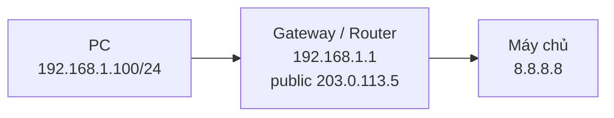

# NAT (Network Address Translation)

**NAT (Network Address Translation – dịch địa chỉ mạng)** là cơ chế **đổi địa chỉ private thành địa chỉ public khi gói tin ra Internet**, cho phép **nhiều thiết bị dùng chung một địa chỉ public** [1].

## Vấn đề nó giải quyết

Kết hợp với khối **[[private-ip-address]]** (RFC 1918), NAT cho phép cả một mạng nội bộ (ví dụ một văn phòng với hàng trăm máy) ra Internet chỉ qua một (hoặc vài) địa chỉ public. Không có NAT, mỗi thiết bị muốn ra Internet sẽ cần một địa chỉ public riêng — bất khả thi khi không gian IPv4 đã cạn.

## Bối cảnh lịch sử

NAT được đề xuất như một **giải pháp tạm thời** từ **RFC 1631 năm 1994** [1]. Cái "tạm thời" đó kéo dài đến nay vì IPv6 chưa thay thế hoàn toàn IPv4.

## NAT liên quan gì tới cổng mặc định (default gateway)

NAT và **[[default-gateway]]** hay bị nhập làm một vì ở nhà/văn phòng nhỏ chúng nằm cùng một thiết bị — nhưng **về bản chất là hai vai trò khác nhau**:

- **Cổng mặc định (default gateway)** là khái niệm **định tuyến**: nơi host gửi gói tin khi đích ở ngoài mạng của mình [1].
- **NAT** là khái niệm **dịch địa chỉ**: viết lại địa chỉ private thành public khi gói tin ra Internet [1].

Một thiết bị có thể đảm nhận **cả hai** (bộ định tuyến (router) Wi-Fi gia đình), hoặc **chỉ một**: trong mạng lớn, cổng mặc định (default gateway) có thể là Layer 3 switch bên trong, còn NAT do firewall/[[router]] ở rìa mạng làm [1]. Vì vậy **không được mặc định rằng "cổng mặc định (default gateway) = thiết bị NAT"**.

### Chuỗi điển hình: PC → gateway → máy chủ

Xét một PC `192.168.1.100/24` (private) gửi tới máy chủ `8.8.8.8` (public) [1]:

Các bước:

1. PC thấy `8.8.8.8` khác mạng → gửi gói cho cổng mặc định (default gateway) `192.168.1.1`.
2. Bộ định tuyến (router) nhận gói, thấy đích ra Internet.
3. Trước khi ra cổng public, bộ định tuyến (router) **dịch địa chỉ nguồn** thành `203.0.113.5` và **ghi nhớ bảng dịch** (địa chỉ private + cổng ↔ địa chỉ public + cổng).
4. Khi trả lời về, bộ định tuyến (router) tra bảng dịch (translation table) và trả gói về đúng PC `192.168.1.100` [1].

Chi tiết cơ chế viết lại cả số cổng: [[port-address-translation]].

## Ba cơ chế giúp IPv4 sống lâu hơn

NAT không đứng một mình. Nó là một trong ba cơ chế ghép lại giúp không gian IPv4 (vốn đã cạn) tiếp tục dùng được [1]:

1. **CIDR (Classless Inter-Domain Routing)** — gộp tuyến (route aggregation, gom nhiều dải địa chỉ thành một tuyến), giảm kích thước bảng định tuyến (routing table). Xem [[cidr]].
2. **Private + NAT (RFC 1918)** — dùng địa chỉ private bên trong, NAT ra public bên ngoài. Xem [[private-ip-address]].
3. **CGNAT** — nhà mạng NAT hai lớp, tận dụng thêm một lớp địa chỉ nữa.

## CGNAT — NAT cấp nhà mạng

**CGNAT (Carrier-Grade NAT – NAT cấp nhà mạng)** là biến thể trong đó **nhà cung cấp dịch vụ (ISP — Internet Service Provider)** cấp cho khách hàng địa chỉ trong khối `100.64.0.0/10`, rồi NAT ở phía mình. Hệ quả: **khách hàng có thể bị NAT hai lớp** — một lần ở bộ định tuyến (router) của khách hàng (private → shared), một lần ở ISP (shared → public) [1].

## Cái giá phải trả

NAT **phá vỡ kết nối đầu-cuối (end-to-end)** — các ứng dụng đặt địa chỉ IP ngay trong **phần dữ liệu (payload) của gói tin**, như VoIP hay IPsec (bộ giao thức bảo mật cho IP), khó hoạt động đúng vì địa chỉ trong phần dữ liệu (payload) không được NAT viết lại [1]. Chi tiết tại [[nat-pha-vo-ket-noi-dau-cuoi-cua-ung-dung]].

Xem thêm: [[private-ip-address]], [[ipv6]], [[nat-pha-vo-ket-noi-dau-cuoi-cua-ung-dung]]

## Tài liệu tham khảo

[1] "IPv4: địa chỉ, mạng và chia mạng con — từ classful đến classless," *ip-addressing-learn* (tài liệu người dùng cung cấp; không ghi rõ tác giả), 2026-10-05.