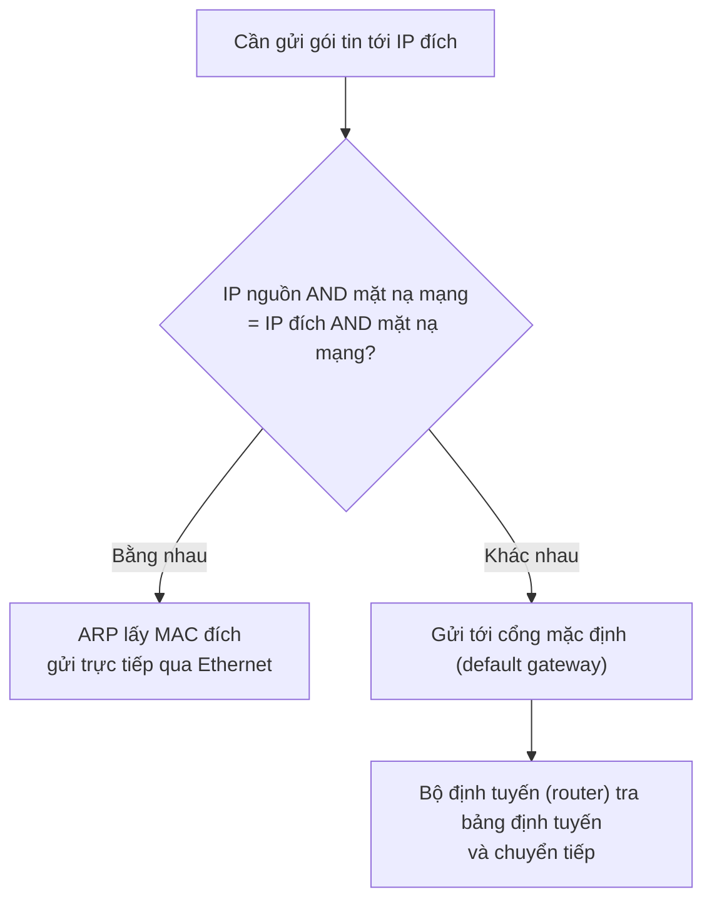

# Mặt nạ mạng (network mask)

**Mặt nạ mạng (network mask)**, còn gọi là **mặt nạ mạng con (subnet mask)**, cho thiết bị biết **phần nào của địa chỉ IP dùng để nhận diện mạng, phần nào dùng để nhận diện một host cụ thể** trên mạng đó.

Mặt nạ là một dãy 32 bit, viết cùng dạng bốn số thập phân như địa chỉ IP:

- Các bit **1** đánh dấu **phần mạng (network portion)**.
- Các bit **0** đánh dấu **phần host (host portion)**.

Ví dụ `255.0.0.0` là 8 bit 1 rồi 24 bit 0 → octet đầu là phần mạng, ba octet sau là phần host.

## Cơ chế: phép AND bit

Để quyết định một địa chỉ đích "cùng mạng" hay "khác mạng", thiết bị áp **mặt nạ mạng (network mask)** của chính nó lên cả **địa chỉ nguồn** và **địa chỉ đích** bằng phép **AND bit**, rồi so hai kết quả:

- **Bằng nhau** → cùng mạng → dùng ARP lấy địa chỉ MAC (MAC address) đích và gửi trực tiếp qua Ethernet.
- **Khác nhau** → khác mạng → gửi tới cổng mặc định (default gateway) để bộ định tuyến (router) chuyển tiếp.

## Ví dụ minh hoạ

**Mặt nạ mạng (network mask) rơi đúng ranh giới octet.** Host `10.4.21.43` với mặt nạ mạng (network mask) `255.0.0.0`:

| IP đích | IP đích AND mặt nạ mạng (network mask) | Kết quả so với `10.0.0.0` |
|---|---|---|
| `10.122.45.155` | `10.0.0.0` | Cùng mạng → ARP trực tiếp |
| `13.1.2.3` | `13.0.0.0` | Khác mạng → gửi cổng mặc định (default gateway) |

**Mặt nạ mạng (network mask) không rơi đúng ranh giới octet.** Phép AND vẫn y như vậy, chỉ khó nhẩm hơn. Địa chỉ `10.1.1.2` với mặt nạ mạng (network mask) `255.255.224.0` (`/19`): octet thứ ba `1 AND 224 = 0`, nên mạng là `10.1.0.0/19`, trải từ `10.1.0.0` đến `10.1.31.255` [1].

## Ranh giới: classful vs classless

- **Classful:** mặt nạ mạng (network mask) **không cần khai báo** vì nó được suy ra từ chính địa chỉ (lớp A → /8, lớp B → /16, lớp C → /24).
- **Classless:** địa chỉ **không còn ngụ ý mặt nạ mạng (network mask)**; phải khai báo tường minh. Cùng một địa chỉ như `10.1.1.2` có thể mang mặt nạ mạng (network mask) `/8`, `/24`, hay `/19` tuỳ cấu hình [2].

Xem thêm: [[ip-address]], [[classful-addressing]], [[classless-addressing]], [[cidr]]

## Tài liệu tham khảo

[1] "IPv4: địa chỉ, mạng và chia mạng con — từ classful đến classless," *ip-addressing-learn* (tài liệu người dùng cung cấp; không ghi rõ tác giả), 2026-10-05.

[2] "Why do we need IP Subnetting?," Introduction to IPv4 Subnetting, NetworkAcademy.io.