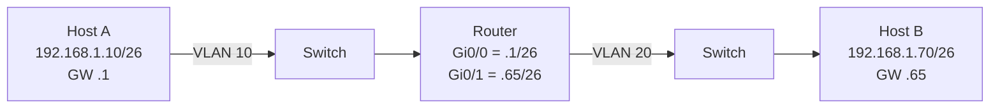

# Chia một khối /24 thành bốn mạng con /26 — vì sao vẫn phải qua router?

## Bối cảnh

Có một khối địa chỉ **`192.168.1.0/24`** được cấp cho một tổ chức. Người quản trị muốn chia nó thành **bốn mạng con (subnet)** nhỏ hơn để tổ chức mạng.

Câu hỏi thật: **hai máy tính ở hai mạng con (subnet) khác nhau, cùng nằm trong `192.168.1.0/24`, có gửi tin trực tiếp cho nhau được không?** Nhiều người trả lời "được, vì chúng cùng một khối". Câu trả lời đó **sai**.

## Tình huống

### Bốn mạng con (subnet) sau khi chia

| Mạng con (subnet) | Dải host dùng được | Địa chỉ quảng bá (broadcast) |
|---|---|---|
| `192.168.1.0/26` | `.1` – `.62` | `192.168.1.63` |
| `192.168.1.64/26` | `.65` – `.126` | `192.168.1.127` |
| `192.168.1.128/26` | `.129` – `.190` | `192.168.1.191` |
| `192.168.1.192/26` | `.193` – `.254` | `192.168.1.255` |

### Sơ đồ vật lý

Quan trọng: **Switch VLAN 10 và Switch VLAN 20 là hai miền quảng bá (broadcast domain) riêng**, nối với nhau qua [[router]] — **không có đường đi trực tiếp qua switch** từ A đến B.

### Host tự phán quyết bằng AND bit

| | Octet cuối | Dạng nhị phân |
|---|---|---|
| **Host A** `192.168.1.10` | 10 | `00001010` |
| **Host B** `192.168.1.70` | 70 | `01000110` |
| **Mask /26** octet cuối | 192 | `11000000` |

Áp AND với mask:

- **A**: `00001010` AND `11000000` = `00000000` = **0** → mạng `192.168.1.0/26`
- **B**: `01000110` AND `11000000` = `01000000` = **64** → mạng `192.168.1.64/26`

**0 ≠ 64 → khác mạng con (subnet)** [1].

## Giải thích

Đây là ví dụ minh hoạ trực tiếp luận điểm tại [[subnet-cung-mot-khoi-van-phai-qua-router]]:

1. **Khối được cấp ≠ mạng con (subnet).** `192.168.1.0/24` là **khối được cấp (allocation)**; các mạng con (subnet) là những dải con với **ranh giới do mặt nạ mạng (network mask)** quyết định [1].
2. **Quyết định thuộc về host, dựa trên mask — không dựa trên vị trí vật lý hay khối gốc.** A và B đều nằm trong `192.168.1.0/24`, nhưng mỗi host so địa chỉ nguồn–địch của mình bằng mask `/26` riêng, phát hiện khác mạng và **gửi gói cho [[default-gateway]]** [1].
3. **Chia một khối tạo ra nhiều miền quảng bá (broadcast domain), không tạo ra kết nối trực tiếp.** ARP của A chỉ quảng bá trong VLAN 10, không với tới VLAN 20 — vì [[router]] chặn quảng bá (broadcast) [1].
4. **Đây là điểm mấu chốt của một mô hình classless:** chia subnet là thao tác **tổ chức lại định chỉ địa chỉ theo nhu cầu quản trị**, không phải thao tác "mở đường đi mới". Đường đi luôn được mở bởi **[[router]]** và **bảng định tuyến (routing table)**, không bởi việc chung khối địa chỉ [1].

Xem thêm: [[ip-network]], [[broadcast-domain]], [[router]], [[host]], [[default-gateway]]

## Tài liệu tham khảo

[1] "IPv4: địa chỉ, mạng và chia mạng con — từ classful đến classless," *ip-addressing-learn* (tài liệu người dùng cung cấp; không ghi rõ tác giả), 2026-10-05.