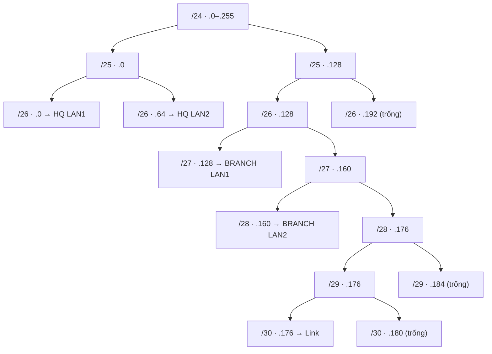

# Sáu cách giải bài toán VLSM (đặt Subnet ID)

## Điều kiện tiên quyết

- Đã có **khối gốc** và **bảng phân bổ** — mỗi mạng đã biết prefix và block size. Nếu chưa, làm bước chọn prefix trước theo [[chia-subnet-theo-so-host]].
- Block size (`2ⁿ`, còn gọi là **pattern value** hay **magic number**) của từng mạng đã tính sẵn.
- Các mạng đã sắp theo **kích thước giảm dần**.

Phương pháp này trả lời câu hỏi còn lại: **đặt Subnet ID ở đâu** trong khối gốc. Nó chỉ khác nhau ở công cụ tính, không khác kết quả.

## Các bước

Bước chuẩn bị chung (áp dụng cho mọi cách): sắp mạng giảm dần rồi tính block size.

| Thứ tự | Mạng | Host + 2 | Block size | n | Prefix |
|---|---|---|---|---|---|
| 1 | HQ LAN1 | 52 | 64 | 6 | `/26` |
| 2 | HQ LAN2 | 52 | 64 | 6 | `/26` |
| 3 | BRANCH LAN1 | 32 | 32 | 5 | `/27` |
| 4 | BRANCH LAN2 | 14 | 16 | 4 | `/28` |
| 5 | Link | 4 | 4 | 2 | `/30` |

Đây là ví dụ xuyên suốt cho cả sáu cách: chia `192.168.40.0/24`, đáp án chuẩn là `.0/26`, `.64/26`, `.128/27`, `.160/28`, `.176/30`.

### Cách A — Block size và con trỏ (số học thuần)

Dùng một "con trỏ" ghi địa chỉ tự do đầu tiên; ban đầu con trỏ = 0.

- Mỗi mạng: **Subnet ID = con trỏ**, **broadcast = Subnet ID + block − 1**, con trỏ mới = Subnet ID + block.
- Trước khi đặt, kiểm tra Subnet ID chia hết cho block size.

| Mạng | Subnet ID | Host dùng được | Broadcast |
|---|---|---|---|
| HQ LAN1 | `.0/26` | `.1 – .62` | `.63` |
| HQ LAN2 | `.64/26` | `.65 – .126` | `.127` |
| BRANCH LAN1 | `.128/27` | `.129 – .158` | `.159` |
| BRANCH LAN2 | `.160/28` | `.161 – .174` | `.175` |
| Link | `.176/30` | `.177 – .178` | `.179` |

Vì cấp từ lớn xuống nhỏ, con trỏ **luôn là bội số của block kế tiếp**, nên không bao giờ phải làm tròn lên [1]. Cisco Community cũng mô tả đúng quy trình này: block kết thúc ở `.127` thì block kế tiếp bắt đầu ở `.128` [3].

### Cách B — Chia đôi liên tiếp ("pie method")

Xem cả khối như một chiếc bánh và liên tục cắt đôi [1]. Quy tắc ngón tay cái: **lấy nửa đầu cho yêu cầu hiện tại, chia tiếp nửa sau cho yêu cầu nhỏ hơn**.

1. Cắt `/24` thành hai khối `/25`: `.0/25` và `.128/25`.
2. Cắt `.0/25` thành hai `/26`: `.0/26` (HQ LAN1) và `.64/26` (HQ LAN2). Khối `/25` đầu dùng hết.
3. Cắt `.128/25` thành `.128/26` và `.192/26`. Giữ `.192/26` để trống.
4. Cắt `.128/26` thành `.128/27` (BRANCH LAN1) và `.160/27`.
5. Cắt `.160/27` thành `.160/28` (BRANCH LAN2) và `.176/28`.
6. Cắt `.176/28` thành `.176/29` và `.184/29`.
7. Cắt `.176/29` thành `.176/30` (Link) và `.180/30`.

Phần trống còn lại: `.180/30`, `.184/29` và `.192/26` — khớp hoàn toàn với cách A.

### Cách C — Cây nhị phân (cách B vẽ thành hình)

Mỗi lần cắt đôi là một nhánh. Lá được tô là mạng đã cấp, lá "trống" là phần dư.

- **Ưu điểm:** nhìn là thấy ngay phần nào còn trống và phần nào chồng lấn (chồng lấn chỉ có thể xảy ra nếu "cấp" cả cha lẫn con).
- **Nhược điểm:** vẽ lâu, hợp để giải thích hoặc ghi tài liệu hơn là để thi.

### Cách D — Nhị phân thuần (xem Subnet ID dưới dạng bit)

- Số bit `0` cuối của mặt nạ mạng (network mask) chính là n (số bit host); khối có `2ⁿ − 2` host dùng được.
- **Subnet ID hợp lệ khi n bit cuối của nó toàn 0**, tức `Subnet ID AND mask = chính nó`. AND là phép logic "cả hai bit đều là 1 thì ra 1".
- Ví dụ: `176 = 10110000` AND mask `252 = 11111100` cho `10110000` = 176, nên hợp lệ.

| Mạng | Octet cuối | Nhị phân | Độ dài tiền tố trong octet |
|---|---|---|---|
| HQ LAN1 | 0 | `00\|000000` | 2 bit |
| HQ LAN2 | 64 | `01\|000000` | 2 bit |
| BRANCH LAN1 | 128 | `100\|00000` | 3 bit |
| BRANCH LAN2 | 160 | `1010\|0000` | 4 bit |
| Link | 176 | `101100\|00` | 6 bit |

Các tiền tố `00`, `01`, `100`, `1010`, `101100` **không cái nào là phần đầu của cái khác** — đó chính là "không chồng lấn" nói bằng ngôn ngữ nhị phân. Mạng cần nhiều host có tiền tố ngắn hơn, nên chiếm vùng rộng hơn [1].

### Cách E — Công thức prefix cộng dồn (hợp với bảng tính)

Thay việc tra bảng bằng công thức, rồi chỉ cần cộng.

- `prefix = 32 − ⌈log₂(host + 2)⌉`, với `⌈ ⌉` là làm tròn lên (`⌈5,7⌉ = 6`).
- Subnet ID đầu tiên = địa chỉ gốc. Subnet ID tiếp theo = Subnet ID trước + block size trước.

| Mạng | host + 2 | log₂ | Làm tròn lên | Prefix | Block | Cộng dồn tới |
|---|---|---|---|---|---|---|
| HQ LAN1 | 52 | 5,70 | 6 | `/26` | 64 | 64 |
| HQ LAN2 | 52 | 5,70 | 6 | `/26` | 64 | 128 |
| BRANCH LAN1 | 32 | 5,00 | 5 | `/27` | 32 | 160 |
| BRANCH LAN2 | 14 | 3,81 | 4 | `/28` | 16 | 176 |
| Link | 4 | 2,00 | 2 | `/30` | 4 | 180 |

Đưa thẳng vào Excel hoặc một đoạn script được, nên rất hợp khi có nhiều mạng. Vẫn cần kiểm tra Subnet ID chia hết block — nhưng nếu thứ tự cấp đúng (lớn trước) thì điều kiện này **tự thỏa** [1].

### Cách F — Liệt kê khối và gạch bỏ (lưới 256 ô)

Liệt kê tất cả khối cùng cỡ rồi gạch những khối đã dùng [2].

1. Với `/26`: các khối là `0–63, 64–127, 128–191, 192–255`. Lấy `0–63` (LAN1) và `64–127` (LAN2).
2. Với `/27` trong vùng còn trống: `128–159, 160–191, 192–223, 224–255`. Lấy `128–159` (BRANCH LAN1).
3. Với `/28`: `0–15, 16–31, …, 144–159, 160–175, …`. Mọi khối trước 160 đã nằm trong vùng đã cấp nên loại. Khối đầu tiên còn trống là `160–175` → BRANCH LAN2.
4. Với `/30`: `176–179, 180–183, …`. Khối đầu tiên còn trống nằm ngay sau BRANCH LAN2 → lấy `176–179` cho link.

- **Ưu điểm:** trực quan nhất, kiểm tra chồng lấn bằng mắt.
- **Nhược điểm:** với khối nhỏ như `/30`, danh sách rất dài (64 khối).

## Kết quả / Tiêu chí hoàn tất

Một lời giải hợp lệ phải qua **ba phép kiểm tra thủ công** (chi tiết và bản tự động ở [[kiem-chung-loi-giai-vlsm-bang-ba-phep-thu-cong-va-ipaddress]]):

1. Mỗi Subnet ID chia hết cho block size của nó: `0, 64, 128, 160, 176` chia hết lần lượt cho `64, 64, 32, 16, 4`. ✓
2. Các khối không chồng lấn: `broadcast mạng trước + 1 = Subnet ID mạng sau` (`63 + 1 = 64`, `127 + 1 = 128`…). ✓ [3]
3. Tổng địa chỉ đã cấp ≤ kích thước khối gốc: `64 + 64 + 32 + 16 + 4 = 180 ≤ 256`, còn dư 76. ✓

## Khi nào không nên dùng

- **Link điểm-điểm (point-to-point):** các lab Cisco dạy theo công thức `2ⁿ − 2` nên dùng `/30`; có prefix `/31` (RFC 3021) tiết kiệm hơn nhưng lệch quy ước lab — xem [[prefix-31-tiet-kiem-dia-chi-cho-link-diem-diem]] [4].
- **Giao thức định tuyến classful cũ:** VLSM không dùng được vì chúng không mang mặt nạ mạng (network mask) kèm tuyến.
- Khi chỉ cần chia đều (mọi mạng cùng cỡ) thì dùng FLSM (Fixed Length Subnet Mask – mặt nạ mạng con có độ dài cố định), không cần phương pháp này.

Sáu cách đều ra **cùng một đáp án**, nên chọn cách nào tuỳ công cụ có sẵn. Nhưng khi có nhiều phương án đặt cùng hợp lệ, hãy chọn theo [[phuong-an-vlsm-hop-le-khac-toi-uu-uu-tien-khoi-trong-lien-ke-lon-nhat]].

Xem thêm: [[chia-subnet-theo-so-host]], [[tra-cuu-prefix-va-buoc-nhay]], [[vlsm]]

## Tài liệu tham khảo

[1] NetworkAcademy.io. "VLSM without Binary Example 1." [Online]. Available: https://www.networkacademy.io/ccna/ip-subnetting/vlsm-without-binary-example1

[2] L. Goswami. "VLSM Subnetting Examples and Calculation Explained," ComputerNetworkingNotes, cập nhật 10/05/2026. [Online]. Available: https://www.computernetworkingnotes.com/ccna-study-guide/vlsm-subnetting-examples-and-calculation-explained.html

[3] Cisco Community. "VLSM, magic number and sequence of correct steps." [Online]. Available: https://community.cisco.com/t5/switching/vlsm-magic-number-and-sequence-of-correct-steps/m-p/3736781/highlight/true

[4] Cisco Networking Academy. "Lab – Designing and Implementing a VLSM Addressing Scheme (9.2.1.4)," CCNA 1. [Online]. Available: https://cisco.tu-sofia.bg/wp-content/uploads/courses/CCNA1/course/files/9.2.1.4%20Lab%20-%20Designing%20and%20Implementing%20a%20VLSM%20Addressing%20Scheme.pdf

## Luyện tập

- Chia `10.0.0.0/24` cho ba mạng cần 100, 50, 20 host. Thử đặt Subnet ID bằng **cách A** rồi kiểm chéo bằng **cách F** — hai kết quả có khớp không?
- Với cùng bộ khối đó, thử **cách D**: viết octet cuối của từng Subnet ID ra nhị phân và kiểm tra không tiền tố nào là phần đầu của tiền tố khác.